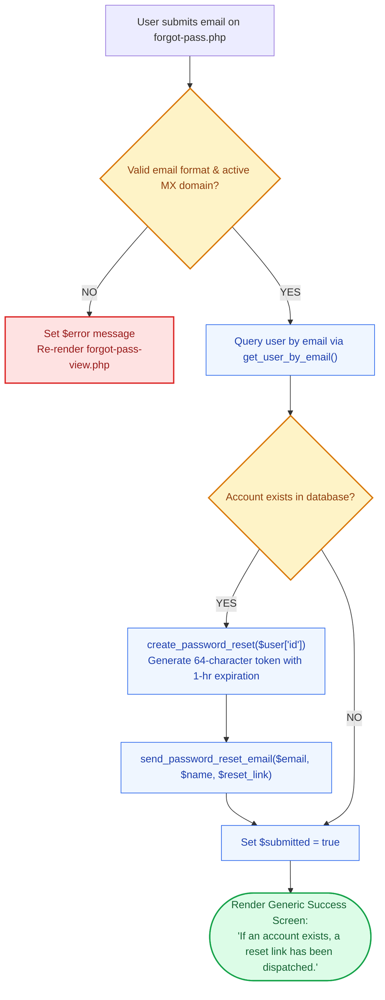

# 🔑 `forgot-pass.php` — Anti-Enumeration Password Recovery Controller

> [!abstract] 📌 Executive Summary
> `forgot-pass.php` handles the initial request phase of the password recovery workflow. It allows users who forgot their credentials to request a secure password reset link sent to their institutional email.
> 
> Key features include:
> 1. **Anti-User Enumeration Defense**: The interface displays a uniform confirmation notice (`$submitted = true`) regardless of whether the email exists in the database, preventing attackers from probing for registered student emails.
> 2. **DNS & MX Domain Validation**: Rejects invalid email domains before contacting the database.
> 3. **Cryptographic Token Generation**: Creates a time-limited 64-character hexadecimal reset token in the `password_resets` table.
> 4. **Email Dispatch**: Sends the formatted reset link via `send_password_reset_email()` in `includes/mailer.php`.

---

## 🏛️ Placement in System Architecture



---

## 🔍 Detailed Line-by-Line Breakdown

### 1. Form Submission & Input Validation (Lines 14–22)
```php
if ($_SERVER['REQUEST_METHOD'] === 'POST') {
    $email = trim($_POST['email'] ?? '');
    if (empty($email) || !filter_var($email, FILTER_VALIDATE_EMAIL)) {
        $error = 'Please enter a valid institutional email address.';
    } else {
        $domain_check = validate_email_domain_dns($email);
        if (!$domain_check['valid']) {
            $error = $domain_check['error'];
        } ...
```
* Ensures the email is syntactically valid and backed by live domain MX records.

---

### 2. Token Creation & Anti-Enumeration Branching (Lines 23–37)
```php
$user = get_user_by_email($email);
if ($user) {
    $token = create_password_reset((int)$user['id']);
    if ($token) {
        $https = (!empty($_SERVER['HTTPS']) && $_SERVER['HTTPS'] !== 'off');
        $host = $_SERVER['HTTP_HOST'] ?? 'localhost';
        $base = rtrim(str_replace('\\', '/', dirname($_SERVER['SCRIPT_NAME'] ?? '/')), '/');
        $reset_link = ($https ? 'https://' : 'http://') . $host . $base . '/reset-password.php?token=' . $token;

        $recipient_name = $user['name'] ?? ($user['organization_name'] ?? 'User');
        send_password_reset_email($email, $recipient_name, $reset_link);
    }
}
$submitted = true;
```
* **Anti-Enumeration Security**: Notice that `$submitted = true;` executes outside the `if ($user)` block. Even if the email is not registered in the database, the page still transitions to the success screen: `"If an account exists with this email address, a password reset link has been dispatched."`

---

## 🛡️ Security & Panel Defense Talking Points

> [!tip] 🎤 High-Yield Defense Q&A for this File
> 
> **Q: How does `forgot-pass.php` protect against User Enumeration attacks?**
> * **Answer:** *"In lines 23–37, the page displays the exact same success message regardless of whether the email exists in our database. An attacker using automated scripts to check if specific professors or students have accounts cannot determine account existence from the server's HTTP responses."*
