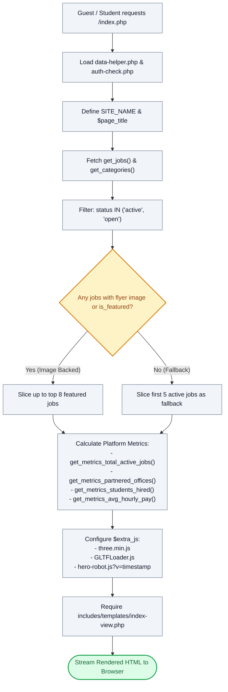

# 🏠 `index.php` — Public Landing Page & Requisition Showcase Controller

> [!abstract] 📌 Executive Summary
> `index.php` acts as the **public portal controller** following the Model-View-Controller (MVC) separation of concerns. It performs no direct HTML markup rendering; instead, it aggregates platform statistics, filters available student assistantship positions, loads 3D graphics assets, and delegates the presentation to `includes/templates/index-view.php`. Key responsibilities include:
> 1. Defining application constants and page metadata.
> 2. Filtering active vacancies and isolating featured requisitions with image flyers.
> 3. Computing macro-level platform impact metrics (active openings, partner offices, students hired, average hourly stipend).
> 4. Injecting WebGL / Three.js 3D companion runtime dependencies.
> 5. Rendering the presentation layer through `index-view.php`.

---

## 🏛️ Placement in System Architecture



---

## 🔍 Line-by-Line Technical Analysis

### Lines 1–14: Environment Bootstrap & Constant Definitions
```php
<?php
/**
 * Campus Job Posting System - Index / Landing Page
 * Paper Sheet Redesign (COAL101 Blueprint)
 */
require_once __DIR__ . '/includes/data-helper.php';
require_once __DIR__ . '/includes/auth-check.php';

if (!defined('SITE_NAME')) {
    define('SITE_NAME', 'CAMPUS HIRE');
}

$page_title = 'Empowering Students, Supporting Campus Offices';
```
- **Lines 6–7**: Loads the system data access layer (`data-helper.php`) and session guard (`auth-check.php`).
- **Lines 9–11**: Safely declares the platform brand identifier `SITE_NAME` if not already initialized by configuration files.
- **Line 13**: Sets `$page_title`, which is consumed by `includes/header.php` to generate the HTML `<title>` tag and OpenGraph metadata.

---

### Lines 15–26: Job Extraction & Visual Showcase Filter
```php
// Data from helper
$categories = get_categories();
$all_active_jobs = array_values(array_filter(get_jobs(), fn($j) => in_array(strtolower($j['status'] ?? 'active'), ['active', 'open'])));
// Qualified Featured Vacancies (Jobs with an attached photo/flyer)
$featured_jobs = array_values(array_filter($all_active_jobs, fn($j) => !empty($j['image']) || !empty($j['is_featured'])));
if (empty($featured_jobs)) {
    // Graceful fallback to general active jobs if no photo-backed jobs exist yet
    $featured_jobs = array_slice($all_active_jobs, 0, 5);
} else {
    $featured_jobs = array_slice($featured_jobs, 0, 8);
}
```
- **Line 16**: Retrieves the full list of campus categories (e.g., Office Support, IT / Technical, Laboratory Assistance).
- **Line 17**: Calls `get_jobs()`, wraps it in an `array_filter()` using case-insensitive validation (`strtolower`) to isolate only positions with an active recruitment status (`active` or `open`). Uses `array_values()` to re-index array keys to `0, 1, 2...`.
- **Lines 19–25**: **Showcase Heuristic**: Isolates jobs that have an associated promotional flyer/banner (`!empty($j['image'])`) or an explicit administrative highlight flag (`!empty($j['is_featured'])`). If found, limits the display to 8 positions; if none exist (such as on a fresh database initialization), gracefully falls back to the first 5 active jobs.

---

### Lines 27–32: Key Aggregate Metrics Calculation
```php
// Key Metrics
$metric_active_jobs = get_metrics_total_active_jobs();
$metric_partnered_offices = get_metrics_partnered_offices();
$metric_students_hired = get_metrics_students_hired();
$metric_avg_pay = get_metrics_avg_hourly_pay();
```
- Extracts high-level institutional impact indicators from `includes/services/job-service.php` and `system-service.php`:
  - `$metric_active_jobs`: Total number of open campus requisitions.
  - `$metric_partnered_offices`: Distinct count of campus institutes and accredited corporate employers posting jobs.
  - `$metric_students_hired`: Count of student assistants with accepted employment contracts.
  - `$metric_avg_pay`: Formatted average hourly stipend rate (e.g., `₱65.00/hr`).

---

### Lines 33–41: 3D Interactive Asset Enqueue & View Delegation
```php
// Interactive 3D Hero Scripts
$extra_js = [
    'assets/js/three.min.js',
    'assets/js/GLTFLoader.js',
    'assets/js/hero-robot.js?v=' . time()
];
// Last line: view template
require __DIR__ . '/includes/templates/index-view.php';
```
- **Lines 34–38**: Injects client-side WebGL dependencies into `$extra_js`. These are dynamically loaded by `includes/footer.php`:
  - `three.min.js`: Three.js 3D rendering engine.
  - `GLTFLoader.js`: Runtime parser for loading 3D mesh models (`.gltf` / `.glb`).
  - `hero-robot.js?v=time()`: Custom interactive robot companion script with cache-busting timestamp query parameter.
- **Line 40**: Transmits the prepared state variables (`$categories`, `$featured_jobs`, `$metric_*`, `$extra_js`) to the visual template `includes/templates/index-view.php`.

---

## 🛡️ Defense Talking Points & Security Disclosures

> [!tip] 🎓 Panelist Q&A Defense Sheet
> 
> **Q: Why does `index.php` not contain any HTML tags?**
> **A:** `index.php` adheres strictly to the **Controller** role in MVC architecture. It handles business logic, filters data arrays, and calls data helper methods. Mixing HTML tags directly inside this file would violate separation of concerns, reduce code maintainability, and make automated testing or view redesigns difficult.
> 
> **Q: How does the landing page protect student confidentiality?**
> **A:** The landing page is public and displays only generalized departmental requisitions, job titles, and aggregate impact statistics. No student names, student IDs, GPA/GWA scores, or submitted application files are ever queried or exposed on this route.
> 
> **Q: What happens if the database is completely empty? Will `index.php` crash or throw fatal PHP warnings?**
> **A:** No. `get_jobs()` and `get_categories()` return empty arrays (`[]`) when no records exist. The fallback logic on lines 20–25 handles empty arrays gracefully, and `array_slice([], 0, 5)` returns `[]`. In `index-view.php`, empty state helpers (`render_empty_state()`) render user-friendly informational notices without crashing.
