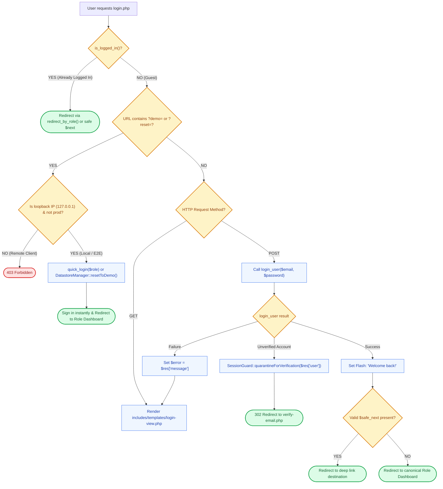

# 🔑 `login.php` — Centralized Authentication Controller

> [!abstract] 📌 Executive Summary
> `login.php` is the **authentication gateway** for all platform roles (`student`, `employer`, `admin`). It manages:
> 1. **Credential Gating (`login_user`)**: Authenticates email and password via `password_verify()`.
> 2. **Verification Quarantine Interception**: Detects unverified email accounts (`is_email_verified === 0`) and automatically invokes `SessionGuard::quarantineForVerification()`.
> 3. **Open-Redirect Protection**: Sanitizes incoming `?next=` deep links using strict regular expressions to block external phishing redirects (CWE-601).
> 4. **Gated Evaluator Hooks (`?demo=` & `?reset=`)**: Provides 1-click evaluation chips for capstone defense while locking remote clients out via loopback IP restrictions (`$__test_hooks_enabled`).
> 5. **View Delegation**: Prepares data and renders `includes/templates/login-view.php`.

---

## 🏛️ Placement in System Architecture



---

## 🔍 Detailed Line-by-Line Breakdown

### 1. Test Hooks Security Guard (Lines 9–15)
```php
$__app_env = strtolower(trim((string)(getenv('APP_ENV') ?: '')));
$__is_production = ($__app_env === 'production' || $__app_env === 'prod');
$__remote_addr = $_SERVER['REMOTE_ADDR'] ?? '';
$__is_loopback = in_array($__remote_addr, ['127.0.0.1', '::1', '::ffff:127.0.0.1'], true);
$__test_hooks_enabled = !$__is_production && $__is_loopback;
```
* **Security Defense**: Ensures test bypass parameters (`?demo=` and `?reset=`) can **never** be exploited on remote networks or production servers. They are strictly restricted to local loopback adapters (`127.0.0.1`).

---

### 2. Gated Demo Triggers (Lines 18–45)
* **`?reset` (Lines 18–27)**: Invokes `DatastoreManager::resetToDemo()`, flashes a confirmation notice, and reloads `login.php`.
* **`?demo=student|employer|admin` (Lines 30–45)**: Validates role against a whitelist, invokes `quick_login($role)`, and routes immediately to the role's dashboard.

---

### 3. Open Redirect Sanitizer (Lines 48–54)
```php
$next_raw = (string)($_POST['next'] ?? ($_GET['next'] ?? ''));
$safe_next = '';
if ($next_raw !== '' && strpos($next_raw, '..') === false && strpos($next_raw, ':') === false && strpos($next_raw, '//') === false) {
    if (preg_match('#^(student|employer|admin)/[A-Za-z0-9/_\-.?=&%]+$#', $next_raw)) {
        $safe_next = $next_raw;
    }
}
```
* **Vulnerability Mitigated**: **Open Redirect (CWE-601)**.
* **Mechanism**: Strips out path traversal tokens (`..`), protocol schemes (`http:`, `https:`), and protocol-relative prefixes (`//`). Enforces a strict whitelist regex matching internal portal prefixes (`student/`, `employer/`, `admin/`).

---

### 4. Active Session Detection (Lines 56–65)
* If `is_logged_in()` is already true, intercepts the visitor and bounces them directly to their role dashboard, preventing redundant logins.

---

### 5. POST Credential Processing (Lines 68–87)
```php
$res = login_user($email, $password);
if ($res['success']) {
    $u = $res['user'];
    set_flash('success', "Welcome back, {$u['name']}!");
    if ($safe_next !== '') {
        header('Location: ' . $safe_next);
        exit;
    }
    redirect_by_role($u['role'] ?? null);
} elseif (!empty($res['unverified'])) {
    SessionGuard::quarantineForVerification($res['user']);
    exit;
} else {
    $error = $res['message'];
}
```
* Coordinates between `login_user()` in `user-service.php` and `SessionGuard::quarantineForVerification()` in `auth-check.php`.

---

## 🛡️ Security & Panel Defense Talking Points

> [!tip] 🎤 High-Yield Defense Q&A for this File
> 
> **Q: How does `login.php` protect against Open Redirect phishing attacks?**
> * **Answer:** *"In lines 48–54, `login.php` strictly sanitizes the `?next=` destination parameter. It rejects any target containing protocol schemes (`:`), external URLs (`//`), or directory traversal (`..`), and uses regular expressions to only allow approved internal paths (`student/*`, `employer/*`, `admin/*`). This stops attackers from crafting links like `login.php?next=https://evil.com` to steal credentials."*
> 
> **Q: Are the 1-click Demo Login chips a security risk?**
> * **Answer:** *"No. Lines 9–15 implement an environment and IP gate: `$__test_hooks_enabled` strictly requires loopback client connections (`127.0.0.1` / `::1`) and verifies that `APP_ENV` is not production. Any remote visitor attempting to trigger `login.php?demo=admin` is rejected with an HTTP 403 Forbidden error."*
