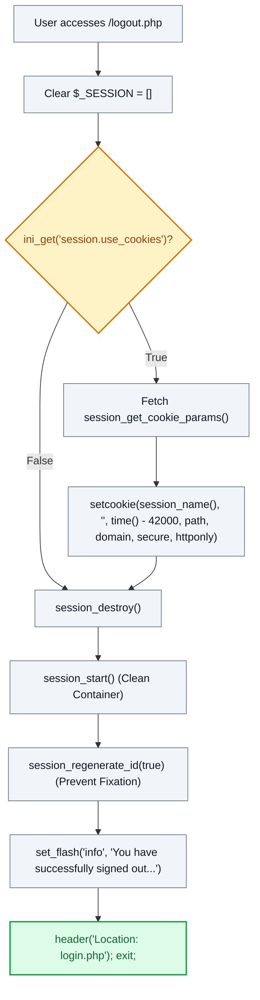

# 🚪 `logout.php` — Session Invalidation & Termination Handler

> [!abstract] 📌 Executive Summary
> `logout.php` provides an RFC-compliant, cryptographically sound teardown of an authenticated user session. It prevents session fixation, session reuse, and cookie hijacking by executing a strict 6-stage destruction pipeline:
> 1. Wipes in-memory session variables (`$_SESSION = []`).
> 2. Invalidates the client session cookie by setting its expiration to the Unix past (`time() - 42000`).
> 3. Destroys server-side session storage via `session_destroy()`.
> 4. Restarts an unauthenticated session via `session_start()`.
> 5. Generates a fresh cryptographic session ID via `session_regenerate_id(true)` to defeat session fixation.
> 6. Enqueues a flash alert via `set_flash()` and terminates with an HTTP 302 redirect to `login.php`.

---

## 🏛️ Placement in System Architecture



---

## 🔍 Line-by-Line Technical Analysis

### Lines 1–6: Bootstrap & Dependency Inclusion
```php
<?php
/**
 * Campus Job Posting System - Logout Handler
 */
require_once __DIR__ . '/includes/data-helper.php';
```
- Loads `data-helper.php`, which initializes the session environment and defines `set_flash()`.

---

### Lines 7–14: Memory Purge & Cookie Annihilation
```php
$_SESSION = [];
if (ini_get("session.use_cookies")) {
    $params = session_get_cookie_params();
    setcookie(session_name(), '', time() - 42000,
        $params["path"], $params["domain"],
        $params["secure"], $params["httponly"]
    );
}
```
- **Line 7 (`$_SESSION = []`)**: Immediately flushes all sensitive credentials, user roles, CSRF tokens, and permissions from PHP's active runtime memory.
- **Lines 8–14**: Verifies whether PHP is configured to use cookie-based session management (`ini_get("session.use_cookies")`). If active:
  - Retrieves exact cookie attributes (`path`, `domain`, `secure`, `httponly`) through `session_get_cookie_params()`.
  - Dispatches an explicit `Set-Cookie` HTTP header with an empty value and an expiration timestamp 42,000 seconds in the past (`time() - 42000`). This forces all RFC 6265 compliant browsers to immediately purge the cookie from local storage.

---

### Lines 15–17: Server Destroy & Clean State Regeneration
```php
session_destroy();
session_start();
session_regenerate_id(true);
```
- **Line 15 (`session_destroy()`)**: Purges the active session data file on the web server's storage disk (e.g., in `/tmp` or `C:\xampp\tmp`).
- **Line 16 (`session_start()`)**: Instantiates a brand new session container to allow storage of one-time flash messages for the redirect.
- **Line 17 (`session_regenerate_id(true)`)**: Generates a completely new cryptographically secure session identifier and destroys the old unlinked session ID, eliminating **Session Fixation attacks**.

---

### Lines 19–21: Flash Feedback & Exit
```php
set_flash('info', 'You have successfully signed out of your account.');
header('Location: login.php');
exit;
```
- **Line 19**: Enqueues an alert informing the user of successful termination.
- **Line 20–21**: Emits an HTTP 302 redirect header to `login.php` followed by immediate execution termination (`exit`) to prevent lingering script execution.

---

## 🛡️ Defense Talking Points & Security Disclosures

> [!tip] 🎓 Panelist Q&A Defense Sheet
> 
> **Q: Why does the code call `session_destroy()`, then `session_start()`, and then `session_regenerate_id(true)`? Why not just `session_destroy()`?**
> **A:** If you call only `session_destroy()`, any subsequent call to `set_flash()` will either fail or throw a PHP warning because there is no active session to hold the flash message. Furthermore, if a browser reconnects with an old session cookie that wasn't properly rotated, an attacker could attempt session fixation. By restarting a clean session and regenerating the ID with `$delete_old_session = true`, we ensure the user receives the sign-out feedback message on a completely fresh, unassociated session ID.
> 
> **Q: What is the significance of `time() - 42000`?**
> **A:** Under HTTP cookie specifications (RFC 6265), setting an expiration date in the past instructs web browsers to delete the cookie immediately. The number 42000 seconds (approximately 11.6 hours in the past) is a standard PHP convention that guarantees the cookie timestamp is safely in the past even if the client's clock is slightly out of sync.
> 
> **Q: Does logging out prevent browser "Back" button access to authenticated pages?**
> **A:** Yes. Because all authenticated pages (`dashboard.php`, `settings.php`, etc.) invoke `require_auth()` via `SessionGuard::enforce()`, any attempt to load those pages after `logout.php` executes will find an empty session and will be redirected to `login.php`. Furthermore, `header.php` sends defensive cache control headers (`Cache-Control: no-store, no-cache, must-revalidate`) preventing browsers from serving cached sensitive DOM views.
