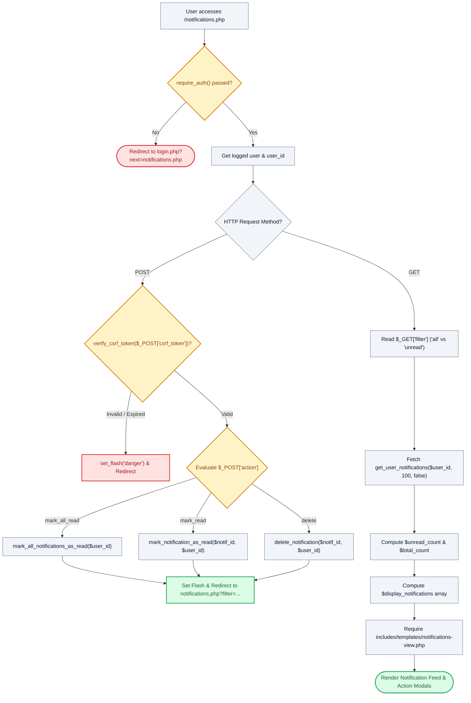

# 🔔 `notifications.php` — In-App Notification Center Controller

> [!abstract] 📌 Executive Summary
> `notifications.php` provides the **centralized alert and communication hub** for all authenticated roles (`student`, `employer`, `admin`). It manages real-time status alerts for job applications, interview schedules, administrative approvals, and account security notifications. The controller processes state-mutating POST requests protected by CSRF session nonces (mark single read, mark all read, delete alert), applies filtering (`all` vs `unread`), and delegates rendering to `includes/templates/notifications-view.php`.

---

## 🏛️ Placement in System Architecture



---

## 🔍 Line-by-Line Technical Analysis

### Lines 1–12: Authentication Gate & Identity Context
```php
<?php
/**
 * Campus Job Posting System - Central Notification Center
 * Complete in-app notification dashboard with All/Unread filters, batch actions, and direct item redirection.
 */
require_once __DIR__ . '/includes/data-helper.php';
require_once __DIR__ . '/includes/auth-check.php';

require_auth();
$user = get_logged_user();
$user_id = (int)$user['id'];
```
- **Line 9 (`require_auth()`)**: Enforces authentication; guests are immediately intercepted and forwarded to `login.php?next=notifications.php`.
- **Lines 10–11**: Extracts the active user entity and casts the primary key to integer (`$user_id = (int)$user['id']`) to prevent SQL injection or type confusion during database queries.

---

### Lines 13–53: State Mutation Handlers (CSRF-Guarded POST Pipeline)
```php
if ($_SERVER['REQUEST_METHOD'] === 'POST') {
    $action = $_POST['action'] ?? '';
    $csrf = $_POST['csrf_token'] ?? '';

    if (!verify_csrf_token($csrf)) {
        set_flash('danger', 'Security validation failed (invalid CSRF session token). Please refresh and try again.');
        header('Location: notifications.php');
        exit;
    }
```
- **Lines 16–22**: Validates that all incoming POST requests contain an active, matching session CSRF token via `verify_csrf_token($csrf)`. Fails safely with an error alert on mismatch.

#### Action 1: `mark_all_read` (Lines 24–30)
```php
    if ($action === 'mark_all_read') {
        mark_all_notifications_as_read($user_id);
        set_flash('success', 'All notifications have been marked as read.');
        $filter_param = isset($_GET['filter']) ? '?filter=' . urlencode($_GET['filter']) : '';
        header('Location: notifications.php' . $filter_param);
        exit;
    }
```
- Calls `mark_all_notifications_as_read($user_id)` from `includes/services/system-service.php`.
- Preserves the user's active filter tab (`$filter_param`) upon redirect.

#### Action 2: `mark_read` (Lines 32–41)
```php
    if ($action === 'mark_read') {
        $notif_id = (int)($_POST['id'] ?? 0);
        if ($notif_id > 0) {
            mark_notification_as_read($notif_id, $user_id);
            set_flash('info', 'Notification marked as read.');
        }
        $filter_param = isset($_GET['filter']) ? '?filter=' . urlencode($_GET['filter']) : '';
        header('Location: notifications.php' . $filter_param);
        exit;
    }
```
- Validates the target alert identifier (`$notif_id > 0`). Notice that `mark_notification_as_read` requires **both `$notif_id` and `$user_id`**, ensuring that a user cannot mark another user's notifications as read (anti-IDOR constraint).

#### Action 3: `delete` (Lines 43–52)
```php
    if ($action === 'delete') {
        $notif_id = (int)($_POST['id'] ?? 0);
        if ($notif_id > 0) {
            delete_notification($notif_id, $user_id);
            set_flash('info', 'Notification deleted.');
        }
        $filter_param = isset($_GET['filter']) ? '?filter=' . urlencode($_GET['filter']) : '';
        header('Location: notifications.php' . $filter_param);
        exit;
    }
```
- Permanently removes the notification record, bound strictly to the owner (`$user_id`).

---

### Lines 54–70: Notification Retrieval, Filtering & View Delegation
```php
// Read parameters & filters
$filter = trim($_GET['filter'] ?? 'all');
$unread_only = ($filter === 'unread');

$all_notifications = get_user_notifications($user_id, 100, false);
$unread_count = count(array_filter($all_notifications, fn($n) => empty($n['is_read'])));
$total_count = count($all_notifications);

$display_notifications = $unread_only 
    ? array_filter($all_notifications, fn($n) => empty($n['is_read']))
    : $all_notifications;

$page_title = 'Notification Center';
// Last line: view template
require __DIR__ . '/includes/templates/notifications-view.php';
```
- **Line 59**: Retrieves up to 100 notifications for `$user_id`. Passing `false` ensures all notifications (read and unread) are fetched.
- **Lines 60–61**: Calculates the exact count of unread notifications to populate the tab badges.
- **Lines 63–65**: Conditionally filters the display array when the user clicks the "Unread" tab.
- **Line 69**: Hands execution over to `notifications-view.php`.

---

## 🛡️ Defense Talking Points & Security Disclosures

> [!tip] 🎓 Panelist Q&A Defense Sheet
> 
> **Q: What stops an attacker from sending a POST request to delete or read another user's notification?**
> **A:** The system enforces dual-layer protection against Insecure Direct Object References (IDOR):
> 1. `$_SESSION['user']['id']` is retrieved securely on the server and passed as `$user_id`.
> 2. The underlying functions (`mark_notification_as_read($notif_id, $user_id)` and `delete_notification($notif_id, $user_id)`) execute SQL statements containing `WHERE id = ? AND user_id = ?`. If an attacker submits another user's `notif_id`, the query matches zero rows and silently fails without affecting other users' data.
> 
> **Q: Why are notification actions executed over POST instead of GET links like `notifications.php?action=delete&id=5`?**
> **A:** Executing state modifications via HTTP GET is a severe security vulnerability. GET requests can be triggered inadvertently by browser pre-fetching engines, web crawlers, or malicious third-party websites embedding `` tags (CSRF). By enforcing HTTP POST and validating `verify_csrf_token()`, unauthorized external execution is completely blocked.
