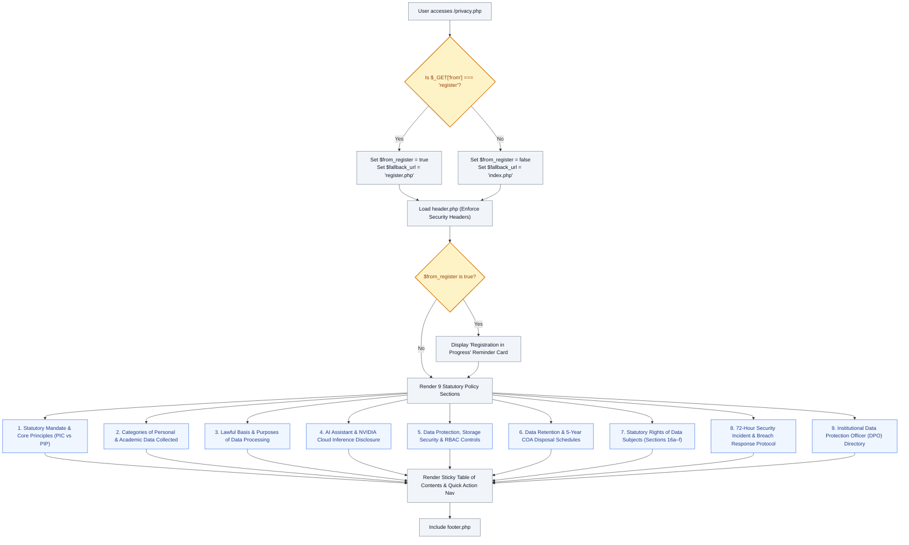

# 🛡️ `privacy.php` — Statutory Data Privacy Policy & AI Processing Disclosure

> [!abstract] 📌 Executive Summary
> `privacy.php` establishes the **statutory data protection covenant** of the KLD Campus Job Posting System under Philippine **Republic Act No. 10173 (Data Privacy Act of 2012)** and National Privacy Commission (NPC) regulations. It also delivers a full disclosure regarding the platform's **conversational AI assistant** (NVIDIA NIM cloud integration), defining boundaries between local university databases and external LLM inference endpoints. It features dynamic return navigation for in-flight account registrations (`?from=register`) and a structured two-column layout with a persistent Table of Contents.

---

## 🏛️ Placement in System Architecture



---

## 🔍 Line-by-Line Technical Analysis

### Lines 1–16: Contextual Routing & Navigation Resolution
```php
<?php
/**
 * Campus Job Posting System - Data Privacy Policy
 * Archetype F: Prose (COAL101 Blueprint)
 * Compliant with Philippine Republic Act No. 10173 (Data Privacy Act of 2012)
 * Comprehensive Statutory Statement & Third-Party AI Data Processing Disclosure
 */
require_once __DIR__ . '/includes/data-helper.php';
require_once __DIR__ . '/includes/auth-check.php';

$page_title = 'Data Privacy Policy & AI Disclosure (RA 10173)';
$from_register = isset($_GET['from']) && $_GET['from'] === 'register';
$fallback_url = $from_register ? 'register.php' : 'index.php';

require_once __DIR__ . '/includes/header.php';
?>
```
- **Lines 12–13**: Detects whether the visitor arrived via the registration form's consent checkbox. If `$_GET['from'] === 'register'`, sets `$fallback_url` to return the user directly to their unsubmitted registration form rather than ejecting them to the home page.
- **Line 15**: Loads `includes/header.php`, ensuring strict Content Security Policies (CSP) and Anti-FOUC theme tokens are active.

---

### Lines 17–50: High-Readability Prose Typography
- Inlines a scoped `.prose` stylesheet specifying `1.0625rem` font size, `1.85` line-height, and `text-justify: inter-word` formatting to ensure legal readability across desktop and mobile screens.

---

### Lines 51–89: Contextual Banner & Smart Back Navigation
- Injects a warning banner if `$from_register` is true:
  > *"Account Registration in Progress: Review the statutory privacy terms and AI processing disclosures below before completing registration."*
- Binds a JavaScript `smartGoBack('register.php')` handler to maintain browser history integrity.

---

### Lines 104–320: The 9 Statutory Clauses

#### Section 1: Statutory Mandate & Core Data Processing Principles
- Identifies **Kolehiyo ng Lungsod ng Dasmariñas (KLD)** as the **Personal Information Controller (PIC)** and third-party vendors as **Personal Information Processors (PIPs)**.
- Formally binds processing to the 4 statutory pillars of RA 10173:
  1. *Transparency*: Prior informed consent with zero dark patterns or pre-checked checkboxes.
  2. *Legitimate Purpose*: Data strictly restricted to assistantship placement and educational grants.
  3. *Proportionality*: Data minimization; prohibition of unnecessary or intrusive data collection.
  4. *Data Quality*: Maintenance of accurate, verified student academic standing.

#### Section 2: Categories of Personal & Academic Data Collected
- Explicitly enumerates all data fields collected by the portal:
  - Personal identification: Full name, Student ID, `@kld.edu.ph` email, phone, municipality of residence.
  - Academic metrics: Institute, degree program, year level, GWA, Certificate of Registration (COR).
  - Application dossiers: PDF resumes, cover letters, skills matrices.
  - Availability schedules: 18-slot weekly matrix.
  - Security telemetry: IP addresses, user agents, session identifiers, CSRF nonces, audit logs.

#### Section 3: Lawful Basis & Purposes of Data Processing
- Cites Sections 12 and 13 of RA 10173: Contractual necessity (assistantship agreements), statutory compliance with municipal and CHED audit codes, and freely given consent.
- Enforces lecture conflict prevention and programmatically protects the **20-hour weekly labor cap**.

#### Section 4: AI Cloud Integration, NVIDIA NIM Services & Model Training Notice
- **Section 4.1 (Third-Party Cloud Microservices)**: Discloses that the conversational assistant connects via TLS 1.3 to NVIDIA NIM endpoints (`https://integrate.api.nvidia.com/v1`). Discloses that prompts sent over developer evaluation tiers may be retained by NVIDIA for model evaluation and RLHF training.
- **Section 4.2 (Categorical Ban on Sensitive Data)**: **Strictly forbids** students and staff from submitting Student IDs, passwords, bank details, home addresses, grades, or disciplinary records into the AI chatbot.
- **Section 4.3 (Impermeable Institutional Isolation)**: Guarantees that official student records, uploaded PDF resumes, and MySQL database tables are stored locally and are **never transmitted, synchronized, or exposed to NVIDIA, OpenAI, or external AI providers**. Documents the deterministic local heuristic regex fallback engine when offline.

#### Section 5: Data Protection & Security Controls
- Documents Role-Based Access Control (RBAC) partitioning across Student, Employer, and Admin suites.
- Details cryptographic credential storage: **Bcrypt hashing (`PASSWORD_DEFAULT`)**, HTTPS/TLS 1.3, CSRF verification nonces, and `.htaccess` file shielding.

#### Section 6: Data Retention & Disposal Policies
- Preserves application dossiers for the active academic term plus one (1) succeeding semester for audit reconciliation.
- Retains Daily Time Records (DTRs) and payroll endorsement manifests for **5 academic years** in compliance with Commission on Audit (COA) statutory regulations.

#### Section 7: Statutory Rights of the Data Subject
- Enumerates all rights under Section 16 of RA 10173:
  - Right to be Informed (§16a)
  - Right of Access (§16c)
  - Right to Rectification (§16d)
  - Right to Erasure or Blocking (§16e)
  - Right to Object (§16b)
  - Right to File a Complaint and Seek Indemnification (§16f) before the National Privacy Commission (`complaints@privacy.gov.ph`).

#### Section 8: Security Incident & Data Breach Management
- Mandates invocation of the KLD Computer Emergency Response Team (CERT) protocol upon any data incident.
- Enforces the statutory **72-hour mandatory notification rule** to the National Privacy Commission and affected data subjects under Section 20(f) of RA 10173 and NPC Circular 16-03.

#### Section 9: Data Protection Officer (DPO) Contact Information
- Publishes official administrative contact details for the KLD Institutional Data Protection Office.

---

## 🛡️ Defense Talking Points & Security Disclosures

> [!tip] 🎓 Panelist Q&A Defense Sheet
> 
> **Q: How does your system comply with the Philippine Data Privacy Act (RA 10173)?**
> **A:** The system satisfies all statutory requirements of RA 10173:
> 1. Clear PIC/PIP role designation.
> 2. Explicit, unbundled consent collected at registration (`register.php`).
> 3. Strict RBAC partitioning ensuring employers only see applicants to their specific department.
> 4. Right to Rectification via profile update requests (`settings.php`).
> 5. Right to Erasure by allowing students to withdraw pending applications.
> 6. Formally codified 72-hour NPC data breach response protocol.
> 
> **Q: If the system uses an AI chatbot, how do you prevent student resumes or personal records from leaking into third-party AI training sets?**
> **A:** As detailed in Section 4.3 and implemented in `includes/ai-config.php`, there is an **air-tight architectural boundary**. The student database, PDF resumes, and application records are stored locally and are never transmitted to the AI API. The only data sent to NVIDIA NIM is the user's typed chat string, wrapped in a generic prompt template. Sensitive data input is strictly prohibited by policy and sanitization filters.
