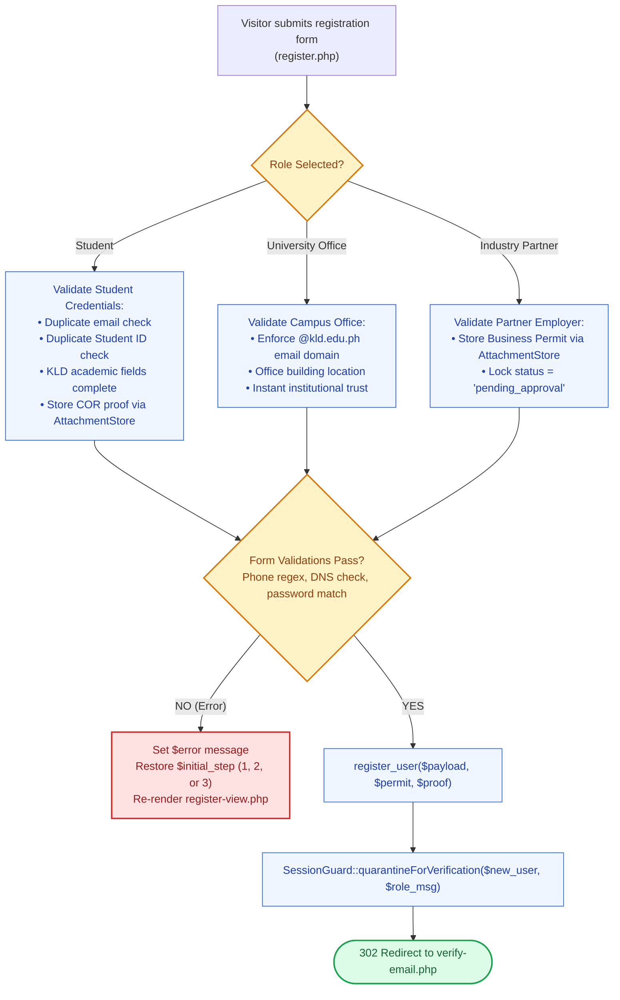

# 📝 `register.php` — Dynamic Multi-Role Registration Gateway

> [!abstract] 📌 Executive Summary
> `register.php` is the **account onboarding controller** for the platform. It provides a dynamic, role-morphing registration gateway supporting three distinct personas:
> 1. **Student Assistants**: Requires Student ID Number, academic institute (ICDI, IE, IN, etc.), degree program, year level, biological sex, birthdate (with automated age calculation), and an official Certificate of Registration (COR) upload via `AttachmentStore`.
> 2. **University Academic / Administrative Offices**: Requires department selection, campus building location, and an official `@kld.edu.ph` institutional email address.
> 3. **Approved Industry Partners**: Requires organization profile, industry category, and mandatory Business Permit / DTI document upload for administrative accreditation.
> 4. **Quarantine Onboarding**: Immediately upon successful database provisioning, passes the user to `SessionGuard::quarantineForVerification()`, issuing a 6-digit email OTP and holding the account in verification quarantine.

---

## 🏛️ Placement in System Architecture



---

## 🔍 Detailed Line-by-Line Breakdown

### 1. Active Session & Persona Setup (Lines 10–23)
* If `is_logged_in()` is true, bounces the visitor to `index.php`.
* Resolves preselected persona from URL (`?role=student` vs. `?role=employer&type=approved_partner`).

---

### 2. Name & Phone Normalization (Lines 25–37 & Lines 91–96)
* Reconciles split fields (`first_name`, `middle_name`, `last_name`) into a clean `$name`.
* **Phone Validation Regex (Lines 94–96)**:
  ```php
  preg_match('/[a-zA-Z]/', $phone) || !preg_match('/^[\+]?[0-9\s\-()]{7,20}$/', $phone)
  ```
  Blocks letters and arbitrary text, enforcing clean numeric telecommunication formats (e.g. `09171234567` or `+63 917 123 4567`).

---

### 3. Institutional Domain & Duplicate Email Checks (Lines 97–108)
* `filter_var($email, FILTER_VALIDATE_EMAIL)`: Standard syntax check.
* `validate_email_domain_dns($email)`: Verifies that the email's domain actually has active MX records on the internet.
* `is_email_registered($email)`: Prevents duplicate user accounts.
* **University Office Gating (Lines 106–108)**:
  ```php
  if ($role === 'employer' && $employer_type === 'university_office' && !preg_match('/@kld\.edu\.ph$/i', $email)) {
      $error = 'University Office accounts must use an official @kld.edu.ph institutional email address.';
  }
  ```

---

### 4. Student Academic Profile & COR Upload (Lines 115–142)
* Validates that Student ID is not already registered via `is_student_id_registered($student_id)`.
* Computes candidate age dynamically via `calculate_age($birthdate)`.
* Stores student Certificate of Registration via `AttachmentStore::storeProof($_FILES['student_proof'])`.

---

### 5. Partner Employer Business Permit Upload (Lines 122–131)
* For industry partners, passes uploaded document to `AttachmentStore::storePermit($_FILES['permit_photo'])`.
* Stores relative path in `$permit_file_path` for subsequent administrative audit in `admin/users.php`.

---

### 6. Provisioning & Quarantine Handshake (Lines 145–183)
```php
$res = register_user([...], $permit_file_path, $proof_file_path);
if ($res['success']) {
    $new_u = $res['user'];
    $role_msg = ($role === 'employer')
        ? 'Your credentials have been submitted for administrative verification.'
        : 'Your student registration and attached credentials are under review.';
    SessionGuard::quarantineForVerification($new_u, $role_msg);
    exit;
}
```
* Binds the new user account to `SessionGuard::quarantineForVerification()`, sending the 6-digit OTP code and routing directly to `verify-email.php`.

---

### 7. View Data Preloading (Lines 188–200)
* Loads `get_kld_institutes_and_courses()`, `get_year_levels()`, and `get_sex_options()`.
* Follows MVC Separation of Concerns: all database/service calls complete in the controller before `includes/templates/register-view.php` is required.

---

## 🛡️ Security & Panel Defense Talking Points

> [!tip] 🎤 High-Yield Defense Q&A for this File
> 
> **Q: How does `register.php` protect the university against identity spoofing and fake accounts?**
> * **Answer:** *"Registration enforces four layers of verification:
>   1. **DNS Validation**: `validate_email_domain_dns()` checks that the email's domain possesses live MX records.
>   2. **Institutional Domain Enforcement**: University office accounts must use `@kld.edu.ph`.
>   3. **Duplicate Prevention**: `is_student_id_registered()` ensures student ID numbers cannot be registered twice.
>   4. **Document Proof**: Students must attach an official COR, and external partners must upload a Business Permit, both of which are validated via `AttachmentStore` and audited by administrators."*
