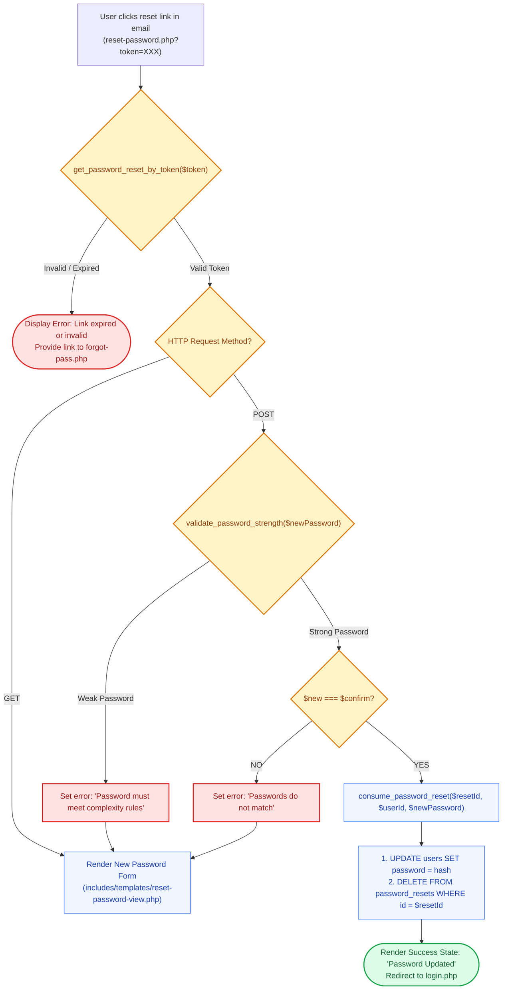

# 🔐 `reset-password.php` — Token Validation & Password Reset Controller

> [!abstract] 📌 Executive Summary
> `reset-password.php` is the **landing target for password reset action links** emailed by `forgot-pass.php`. It handles:
> 1. **Cryptographic Token Verification**: Validates the incoming `?token=` parameter against the `password_resets` table to ensure it is authentic and unexpired.
> 2. **Password Strength Enforcement (`validate_password_strength`)**: Enforces minimum 8 characters, mixed case, numbers, and symbols.
> 3. **Single-Use Token Consumption (`consume_password_reset`)**: Atomically updates the user's password hash (`password_hash`) and permanently deletes the token to prevent replay attacks.
> 4. **Success State & View Delegation**: Renders `includes/templates/reset-password-view.php`.

---

## 🏛️ Placement in System Architecture



---

## 🔍 Detailed Line-by-Line Breakdown

### 1. Token Inspection (Lines 9–10)
```php
$token = trim($_GET['token'] ?? ($_POST['token'] ?? ''));
$reset = $token !== '' ? get_password_reset_by_token($token) : null;
```
* Safely inspects both GET and POST requests.
* Calls `get_password_reset_by_token()` which queries the database and verifies that `expires_at >= NOW()`.

---

### 2. Password Complexity & Match Validations (Lines 15–29)
```php
$strength = validate_password_strength($new);

if (!$reset) {
    $error = 'This reset link is invalid or has expired. Please request a new one.';
} elseif (!$strength['valid']) {
    $error = $strength['error'];
} elseif ($new !== $confirm) {
    $error = 'New password and confirm password do not match.';
}
```
* Server-side mirror of the client-side 5-point password strength meter.

---

### 3. Single-Use Token Consumption (Lines 30–35)
```php
if (consume_password_reset((int)$reset['id'], (int)$reset['user_id'], $new)) {
    $done = true;
} else {
    $error = 'Could not update password. Please try again.';
}
```
* **Replay Attack Defense**: `consume_password_reset()` runs an atomic transaction that updates the user's password hash and **deletes the reset record**. Once consumed, clicking the link a second time yields `"This reset link is invalid or has expired"`.

---

## 🛡️ Security & Panel Defense Talking Points

> [!tip] 🎤 High-Yield Defense Q&A for this File
> 
> **Q: How does `reset-password.php` protect against Password Reset Replay Attacks?**
> * **Answer:** *"In `consume_password_reset()` (Line 30), reset tokens are strictly single-use. As soon as the new password hash is committed, the token is permanently deleted from the `password_resets` table. If an eavesdropper intercepts the email or reuses browser history, the link is immediately rejected."*
