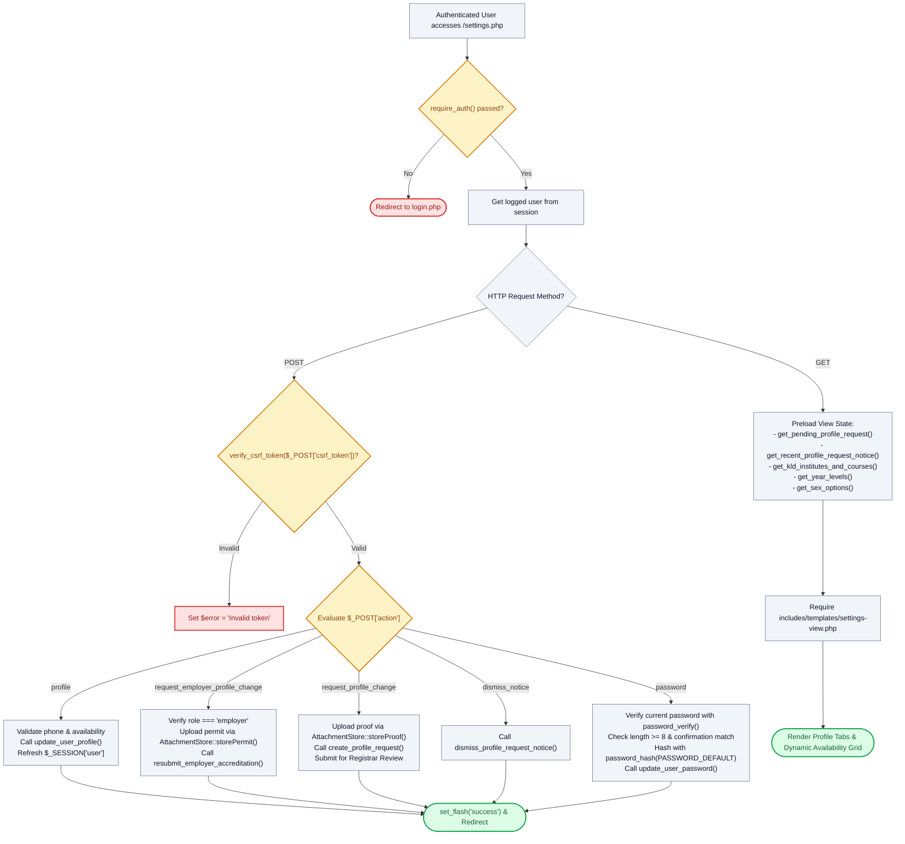

# ⚙️ `settings.php` — User Profile & Operational Preferences Controller

> [!abstract] 📌 Executive Summary
> `settings.php` serves as the **multi-role account management controller** for Students, Employers, and Administrators. It consolidates personal contact editing, student shift availability matrix management, employer accreditation document re-submission, official academic profile modification requests (which require registrar approval), and Bcrypt-secured password rotation. All POST actions are strictly guarded by CSRF tokens, input validation, and magic-byte file upload filters via `AttachmentStore`.

---

## 🏛️ Placement in System Architecture



---

## 🔍 Line-by-Line Technical Analysis

### Lines 1–18: Authentication & CSRF Validation Gate
```php
require_auth();
$user = get_logged_user();
$page_title = 'Account Settings & Preferences';

$error = null;

if ($_SERVER['REQUEST_METHOD'] === 'POST') {
    if (!verify_csrf_token($_POST['csrf_token'] ?? '')) {
        $error = 'Security validation failed: Invalid or expired security token. Please try again.';
    } else {
        $action = $_POST['action'] ?? '';
```
- Restricts endpoint to authenticated accounts.
- Rejects any unauthorized POST request lacking a valid cryptographic CSRF token.

---

### Lines 21–53: Action `profile` — Contact & Availability Matrix Mutation
```php
if ($action === 'profile') {
    $phone = trim($_POST['phone'] ?? '');
    $availability = $_POST['availability'] ?? [];

    $digits_only = preg_replace('/[^0-9]/', '', $phone);
    if (!empty($phone) && (preg_match('/[a-zA-Z]/', $phone) || !preg_match('/^[\+]?[0-9\s\-()]{7,20}$/', $phone) || strlen($digits_only) < 7 || strlen($digits_only) > 15)) {
        $error = 'Contact phone number must contain valid numbers only (e.g. 09171234567 or +63 917 123 4567)...';
    } elseif (($user['role'] ?? '') === 'student' && (empty($availability) || count($availability) === 0)) {
        $error = 'Candidate Shift Availability is required and cannot be empty. Please select at least one weekly timeslot.';
    } else {
        $user_role = $user['role'] ?? 'student';
        $profile_data = [
            'phone' => $phone,
            'name' => trim($_POST['name'] ?? ''),
            'availability' => $availability,
            'office_location' => trim($_POST['office_location'] ?? '')
        ];

        if (update_user_profile((int)$user['id'], $user_role, $profile_data)) {
            // Refresh session user
            $fresh = get_user_by_id((int)$user['id']);
            if ($fresh) {
                unset($fresh['password']);
                $_SESSION['user'] = $fresh;
            }

            set_flash('success', 'Profile and operational settings have been updated successfully.');
            header('Location: settings.php');
            exit;
        }
```
- **Phone Validation**: Strips formatting symbols to inspect digit counts (`strlen($digits_only)` between 7 and 15) and rejects alphabetical characters.
- **Availability Enforcement**: For students, rejects empty submissions to ensure candidate search algorithms always have scheduling data.
- **Session Re-hydration**: Calls `get_user_by_id`, strips the password hash with `unset($fresh['password'])`, and immediately updates `$_SESSION['user']` so changes take effect across all navigation components without requiring re-login.

---

### Lines 54–102: Action `request_employer_profile_change` — Accreditation Resubmission
```php
} elseif ($action === 'request_employer_profile_change') {
    if (($user['role'] ?? '') !== 'employer') {
        $error = 'Unauthorized operation: Employer accreditation requests are restricted to employer accounts.';
    } else {
        // ...
        $permitRes = AttachmentStore::storePermit($_FILES['permit_file']);
        if ($permitRes->isOk()) {
            $permit_path = $permitRes->path();
        }
        // ...
        $res = resubmit_employer_accreditation((int)$user['id'], [
            'organization_name' => $org_name,
            'name'              => $rep_name
        ], $permit_path, $reason);
```
- Allows campus offices and partner employers to update corporate credentials or re-submit rejected business permits.
- Routes file uploads through `AttachmentStore::storePermit()`, verifying magic bytes and placing them in isolated storage.

---

### Lines 103–119: Action `request_profile_change` — Student Academic Record Audit
```php
} elseif ($action === 'request_profile_change') {
    $reason = trim($_POST['reason'] ?? '');
    $proof_path = null;
    $proofRes = AttachmentStore::storeProof($_FILES['proof_file'] ?? null);
    if ($proofRes->isOk()) {
        $proof_path = $proofRes->path();
        $res = create_profile_request($user['id'], $_POST, $proof_path, $reason);
        if ($res['success']) {
            set_flash('success', 'Your official profile change request has been submitted to the University Admin / Registrar for review.');
            header('Location: settings.php');
            exit;
        }
```
- **Academic Integrity Guard**: Students cannot arbitrarily edit their GWA, Institute, Course, or Student ID directly on their profile. Instead, this action uploads proof (such as a new COR or official transcript) and logs a pending change request in `admin_profile_requests` via `create_profile_request()`.

---

### Lines 124–148: Action `password` — Password Rotation
```php
} elseif ($action === 'password') {
    $current_pass = $_POST['current_password'] ?? '';
    $new_pass = $_POST['new_password'] ?? '';
    $confirm_pass = $_POST['confirm_password'] ?? '';

    $fresh_user = get_user_by_id($user['id']);
    $stored_pass = $fresh_user['password'] ?? '';
    $is_current_valid = password_verify($current_pass, $stored_pass) || ($stored_pass === $current_pass);

    if (empty($current_pass)) {
        $error = 'Please enter your current password to confirm your identity.';
    } elseif (!$is_current_valid) {
        $error = 'The current password you entered is incorrect.';
    } elseif (strlen($new_pass) < 8) {
        $error = 'New password must contain at least 8 characters.';
    } elseif ($new_pass !== $confirm_pass) {
        $error = 'New password and confirm password do not match.';
    } else {
        $hashed_password = password_hash($new_pass, PASSWORD_DEFAULT);
        update_user_password($user['id'], $hashed_password);
        set_flash('success', 'Your password has been updated successfully.');
        header('Location: settings.php');
        exit;
    }
}
```
- Authenticates the current password using `password_verify()`.
- Enforces an 8-character minimum length constraint.
- Hashes the new credential using standard **Bcrypt (`PASSWORD_DEFAULT`)** before persistence.

---

### Lines 152–169: Data Preloading & View Delegation
```php
$user_availability = $user['availability'] ?? [ ... ];

$pending_req = (($user['role'] ?? '') === 'student') ? get_pending_profile_request($user['id']) : null;
$recent_notice = (($user['role'] ?? '') === 'student') ? get_recent_profile_request_notice($user['id']) : null;

// Preload view data — no service/DB calls in the template
$view_get_system_data_mode = get_system_data_mode();
$view_get_kld_institutes_and_courses = get_kld_institutes_and_courses();
$view_get_year_levels = get_year_levels();
$view_get_sex_options = get_sex_options();

require __DIR__ . '/includes/templates/settings-view.php';
```
- Prepares all select options and pending approval statuses in controller memory, ensuring `settings-view.php` contains zero database calls.

---

## 🛡️ Defense Talking Points & Security Disclosures

> [!tip] 🎓 Panelist Q&A Defense Sheet
> 
> **Q: Why are students not allowed to directly edit their Course or GWA on this settings page?**
> **A:** GWA and enrolled units directly govern eligibility for campus assistantships (minimum 2.50 GWA and 12 units). If students could arbitrarily edit these values, anyone could alter their GPA to bypass eligibility gates. The system enforces an auditable **Profile Change Request** pipeline where changes require uploading supporting documentation (COR or grade slip) and formal administrative approval by the Registrar or SASO Admin.
> 
> **Q: Why does the password rotation logic verify the current password before accepting the new one?**
> **A:** Requiring the current password defends against unauthorized credential takeovers if an authenticated session is temporarily left unattended on a shared campus terminal or library computer. An attacker cannot lock out the rightful owner without already knowing their existing password.
