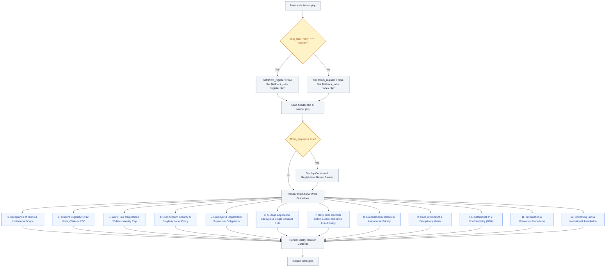

# 📜 `terms.php` — Terms of Service & Campus Work Guidelines

> [!abstract] 📌 Executive Summary
> `terms.php` codifies the **institutional labor and academic standards** governing student assistantships at Kolehiyo ng Lungsod ng Dasmariñas (KLD). It establishes the legal framework binding student applicants, faculty supervisors, campus administrative offices, and accredited corporate partners. Crucially, it defines the statutory **20-hour weekly work limit**, academic eligibility benchmarks (GWA $\le 2.50$, $\ge 12$ units), examination moratoriums, zero-tolerance DTR falsification policies, and single-contract enforcement.

---

## 🏛️ Placement in System Architecture



---

## 🔍 Line-by-Line Technical Analysis

### Lines 1–16: Initialization & Routing
```php
<?php
/**
 * Campus Job Posting System - Terms of Service & Campus Work Guidelines
 * Archetype F: Prose (COAL101 Blueprint)
 * Updated for Academic Year 2026-2027 (KLD SASO Regulatory Standards)
 */
require_once __DIR__ . '/includes/data-helper.php';
require_once __DIR__ . '/includes/auth-check.php';

$page_title = 'Terms of Service & Campus Work Guidelines';
$from_register = isset($_GET['from']) && $_GET['from'] === 'register';
$fallback_url = $from_register ? 'register.php' : 'index.php';

require_once __DIR__ . '/includes/header.php';
?>
```
- Implements seamless roundtrip navigation for registering users (`$from_register`), preventing data loss in multi-step form registration.

---

### Key Statutory Clauses & Institutional Governance

#### Section 2: Student Assistant Eligibility & Academic Load Requirements
- **Minimum 12 Academic Units**: Mandates regular undergraduate matriculation carrying at least 12 units to ensure that work-study grants support continuing students rather than external or non-enrolled persons.
- **Academic Standing (GWA $\le 2.50$)**: Mandates a General Weighted Average of 2.50 or better, with no unexcused drops or unresolved failing marks (5.0).
- **Certificate of Registration (COR)**: Requires uploading verified proof of enrollment and class timetable.

#### Section 3: Work Hour Regulations (20-Hour Weekly Cap)
- **The 20-Hour Limit**: Explicitly codifies that student assistants may not work more than 20 hours per week during regular instructional periods.
- **Anti-Coercion Clause**: Strictly prohibits supervisors from requiring students to skip lectures or exams.
- **Vacation / Recess Exception**: Allows up to 40 hours per week during official semester breaks, subject to prior department approval.
- **Weekly Shift Matrix**: Highlights the algorithmic verification through the 18-slot matrix preventing shift assignments that intersect with class schedules.

#### Section 4: Single-Account & Single-Identity Integrity
- Enforces a 1:1 user-to-account mapping. Creation of secondary dummy accounts or credential sharing results in disciplinary referral to the KLD Student Disciplinary Board.
- Requires `@kld.edu.ph` institutional email domains for all student and internal staff accounts.

#### Section 6: Application Lifecycle & Single Active Contract Limit
- **5-Stage Pipeline**: *Pending Review* $\rightarrow$ *Under Evaluation* $\rightarrow$ *Interview Scheduled* $\rightarrow$ *Accepted / Declined* (or *Withdrawn*).
- **Single-Contract Rule**: While students can apply to multiple job openings simultaneously, once accepted and contracted into an active position, all other pending applications are automatically terminated to prevent double-contracting and payroll conflicts.

#### Section 7: Daily Time Records (DTR) & Allowance Disbursement
- **Anti-Fraud Provision**: Zero tolerance for "buddy punching", forging supervisor signatures, or claiming unrendered work hours. Fraud results in immediate contract cancellation and mandatory restitution of disbursed stipends.
- **Disbursement Schedule**: Cutoffs on the 15th and end of month, released via the University Cashier, accredited banks, or verified digital wallets.

#### Section 8: Examination Moratorium
- Guarantees student assistants the right to suspend or reduce work hours during official Midterm and Final Examination Weeks without penalty.
- Mandates a recruitment blackout during examination weeks.

---

## 🛡️ Defense Talking Points & Security Disclosures

> [!tip] 🎓 Panelist Q&A Defense Sheet
> 
> **Q: What prevents a student from holding three different jobs on campus and neglecting their studies?**
> **A:** Section 6.4 codifies the Single-Contract Rule. In the codebase (`includes/services/application-service.php`), once a student is accepted (`status = 'accepted'`) for a requisition, any pending applications in other departments are automatically closed, and the system blocks the student from applying to new positions while actively contracted.
> 
> **Q: How does the system handle examination periods?**
> **A:** As codified in Section 8, students are legally entitled to request shift pauses during exam weeks with 3 days' advance notice. Supervisors cannot penalize or replace a student assistant for exercising their examination moratorium right.
