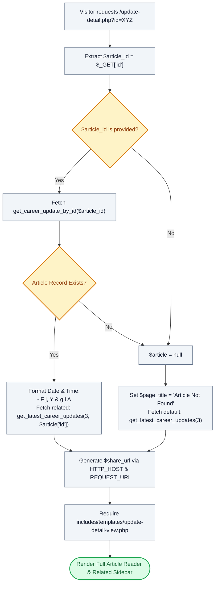

# 📖 `update-detail.php` — Career Center Article Reader Controller

> [!abstract] 📌 Executive Summary
> `update-detail.php` serves as the **individual article reader controller** for campus announcements, career advisories, and administrative circulars. It accepts an article identifier via `$_GET['id']`, retrieves the matching record via `get_career_update_by_id()`, formats timestamps, queries related recommendations excluding the active article (`get_latest_career_updates(3, $article['id'])`), calculates canonical sharing URLs, and delegates rendering to `includes/templates/update-detail-view.php`.

---

## 🏛️ Placement in System Architecture



---

## 🔍 Line-by-Line Technical Analysis

### Lines 1–15: Parameter Extraction & Article Lookup
```php
<?php
/**
 * Campus Job Posting System - Career Center Article Detail Reader
 * Archetype F: Public & Information Reader (COAL101 Blueprint)
 */
require_once __DIR__ . '/includes/data-helper.php';
require_once __DIR__ . '/includes/auth-check.php';

$article_id = $_GET['id'] ?? null;
$article = null;

if ($article_id !== null) {
    $article = get_career_update_by_id($article_id);
}
```
- Retrieves the requested article identifier from the URL query string.
- Executes `get_career_update_by_id($article_id)` against the persistence layer.

---

### Lines 16–25: Branching & Related Content Synthesis
```php
if ($article) {
    $page_title = $article['title'] . ' | Career Center';
    $pub_time = strtotime($article['published_at'] ?? 'now');
    $formatted_date = date('F j, Y', $pub_time);
    $formatted_time = date('g:i A', $pub_time);
    $latest_articles = get_latest_career_updates(3, $article['id']);
} else {
    $page_title = 'Article Not Found | Career Center';
    $latest_articles = get_latest_career_updates(3);
}
```
- **If Found**:
  - Dynamically builds `$page_title` using the article's headline.
  - Converts the ISO timestamp into user-friendly localized formats (e.g. `September 29, 2026` at `6:45 PM`).
  - Calls `get_latest_career_updates(3, $article['id'])`, specifically passing `$article['id']` as the exclusion parameter to prevent recommending the current article in the sidebar.
- **If Not Found (Graceful 404 Degradation)**:
  - Sets the page title to *Article Not Found* and fetches the 3 most recent articles so the reader is not left with a dead end.

---

### Lines 27–32: Canonical Share URL & View Handover
```php
// Preload view data — no service/DB calls in the template
$share_url = 'http://' . ($_SERVER['HTTP_HOST'] ?? '') . ($_SERVER['REQUEST_URI'] ?? '');

// Last line: view template
require __DIR__ . '/includes/templates/update-detail-view.php';
```
- Constructs the full canonical sharing link for clipboard or social sharing.
- Invokes `update-detail-view.php`.

---

## 🛡️ Defense Talking Points & Security Disclosures

> [!tip] 🎓 Panelist Q&A Defense Sheet
> 
> **Q: What happens if an attacker inputs SQL injection syntax or an invalid ID in the `?id=` parameter?**
> **A:** In `includes/services/system-service.php`, `get_career_update_by_id()` binds parameters via PDO prepared statements (`execute([':id' => $id])`) with `PDO::ATTR_EMULATE_PREPARES = false`. SQL injection characters cannot alter query structure. If no record matches, `$article` evaluates to `null`, triggering the graceful fallback without exposing system errors.
> 
> **Q: Why does `get_latest_career_updates()` accept a second parameter?**
> **A:** The second parameter is an `exclude_id`. It ensures that when reading an article, that same article does not appear under "Related Updates" in the sidebar, adhering to standard UX design principles.
