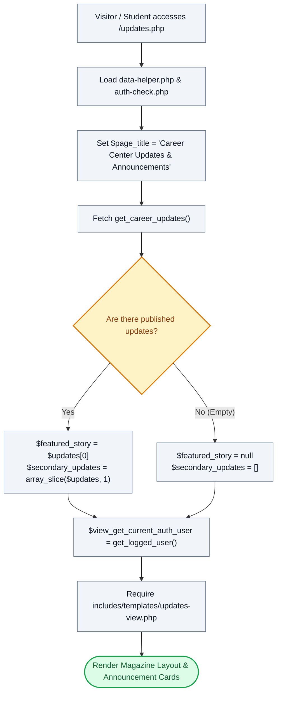

# 📰 `updates.php` — Career Center News & Editorial Announcements Controller

> [!abstract] 📌 Executive Summary
> `updates.php` operates as the **institutional announcements and career editorial controller**. It fetches the latest advisories, career workshop announcements, and student assistantship news published by the Student Affairs and Services Office (SASO). It partitions stories into a primary **Featured Top Story** and an archival list of secondary articles, preloads viewer authentication context, and delegates presentation to `includes/templates/updates-view.php`.

---

## 🏛️ Placement in System Architecture



---

## 🔍 Line-by-Line Technical Analysis

### Lines 1–11: Initialization & Data Extraction
```php
<?php
/**
 * Campus Job Posting System - Career Center Updates & Editorial Dispatch
 * Impeccable Design Standard & Information Architecture (COAL101 Blueprint)
 */
require_once __DIR__ . '/includes/data-helper.php';
require_once __DIR__ . '/includes/auth-check.php';

$page_title = 'Career Center Updates & Announcements';
$updates = get_career_updates();
```
- Loads system helpers and queries published announcements from `includes/services/system-service.php` via `get_career_updates()`.

---

### Lines 12–15: Editorial Hierarchy Partitioning
```php
// Separate featured top story from the rest of the feed
$featured_story = !empty($updates) ? $updates[0] : null;
$secondary_updates = !empty($updates) ? array_slice($updates, 1) : [];
```
- **Editorial Partition**: Selects the most recent article (`$updates[0]`) as the high-impact visual banner story.
- Uses `array_slice($updates, 1)` to collect all subsequent announcements into a secondary grid layout.

---

### Lines 16–21: Preloading & View Handover
```php
// Preload view data — no service/DB calls in the template
$view_get_current_auth_user = get_logged_user();

// Last line: view template
require __DIR__ . '/includes/templates/updates-view.php';
```
- Pre-extracts current user session state to allow the template to display personalized administrative authoring controls if the logged-in user is an administrator.
- Forwards execution to `includes/templates/updates-view.php`.

---

## 🛡️ Defense Talking Points & Security Disclosures

> [!tip] 🎓 Panelist Q&A Defense Sheet
> 
> **Q: How does this page fit into the overall university communication workflow?**
> **A:** Rather than relying solely on disparate physical bulletin boards or social media posts, `updates.php` provides an authenticated, official institutional feed for hiring moratoriums, job fair announcements, and stipend disbursement advisories.
> 
> **Q: How does this page handle cases where no announcements have been published yet?**
> **A:** If `$updates` is empty, `$featured_story` safely resolves to `null` and `$secondary_updates` to `[]`. The template `updates-view.php` includes conditional empty-state rendering via `render_empty_state()` to guide users without throwing PHP notices or warnings.
