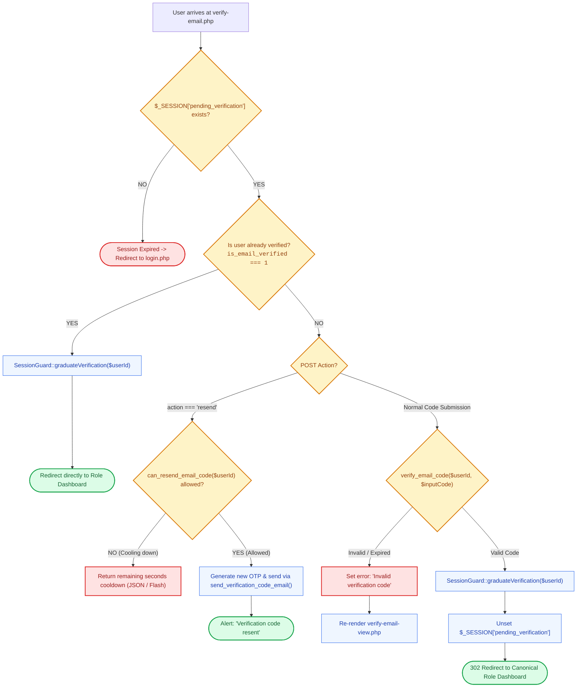

# ✉️ `verify-email.php` — Email Verification & Quarantine Controller

> [!abstract] 📌 Executive Summary
> `verify-email.php` is the **Verification Quarantine controller** of the platform. When a student registers or signs in with an unverified account (`is_email_verified === 0`), `SessionGuard` restricts them to this interface until they confirm their identity.
> 
> Key capabilities include:
> 1. **Dual Transport Support (HTML & AJAX)**: Seamlessly processes standard form submissions or background asynchronous `fetch()` requests from the 6-box OTP JavaScript widget.
> 2. **Session Graduate Gate (`graduateVerification`)**: If an account is confirmed, it promotes the quarantined state (`$_SESSION['pending_verification']`) to a fully authenticated user session (`$_SESSION['user']`).
> 3. **Throttled OTP Resend (`can_resend_email_code`)**: Enforces a 60-second cooldown timer between OTP resend requests to protect the university SMTP server from abuse.
> 4. **Cancellation Handshake**: Allows users to cancel verification and return to `login.php`.

---

## 🏛️ Placement in System Architecture



---

## 🔍 Detailed Line-by-Line Breakdown

### 1. Dual AJAX / HTTP Detection (Lines 10–13)
```php
$is_ajax = (!empty($_SERVER['HTTP_X_REQUESTED_WITH']) && strtolower($_SERVER['HTTP_X_REQUESTED_WITH']) === 'xmlhttprequest')
    || (isset($_SERVER['HTTP_ACCEPT']) && str_contains($_SERVER['HTTP_ACCEPT'], 'application/json'));
```
* Identifies whether the request originated from a standard page load or an asynchronous `fetch()` call from `assets/js/otp-verify.js`. If AJAX, all returns are formatted as JSON payloads (`['success' => bool, 'redirect' => string, 'message' => string]`).

---

### 2. Session Integrity & Auto-Graduation (Lines 20–66)
* **Lines 20–33**: Verifies that `$_SESSION['pending_verification']` contains a valid `user_id`. If expired, safely redirects to `login.php`.
* **Lines 54–66**: Checks if the account was verified concurrently in another tab. If `is_email_verified === 1`, calls `SessionGuard::graduateVerification($user_id)` and immediately redirects to the dashboard without forcing the student to re-enter a code.

---

### 3. Rate-Limited OTP Resend Handler (Lines 74–120)
```php
if ($_SERVER['REQUEST_METHOD'] === 'POST' && isset($_POST['action']) && $_POST['action'] === 'resend') {
    $resend_status = can_resend_email_code($user_id);
    if (!$resend_status['allowed']) {
        $msg = "Please wait {$resend_status['remaining_seconds']}s before requesting another code.";
        ...
    } else {
        $code = create_email_verification_code($user_id);
        $mail_res = send_verification_code_email($pending_email, $pending_name, $code);
        ...
    }
}
```
* **Cooldown Protection**: `can_resend_email_code()` queries the database timestamp of the last generated code. If requested within 60 seconds, returns the remaining cooldown seconds to update the client countdown timer.

---

### 4. Code Verification & Session Promotion (Lines 122–175)
```php
if (verify_email_code($user_id, $code)) {
    $user = SessionGuard::graduateVerification($user_id);
    set_flash('success', 'Your institutional email address has been verified successfully!');
    if ($is_ajax) {
        echo json_encode([
            'success' => true,
            'redirect' => SessionGuard::getRoleDashboardUrl($user['role'] ?? null)
        ]);
        exit;
    }
    SessionGuard::redirectByRole($user['role'] ?? null);
}
```
* Validates the 6-digit code against `email_verifications`.
* On success, invokes `SessionGuard::graduateVerification()`, which unsets `$_SESSION['pending_verification']` and populates `$_SESSION['user']`, safely transitioning the user from quarantine to active authenticated status.

---

## 🛡️ Security & Panel Defense Talking Points

> [!tip] 🎤 High-Yield Defense Q&A for this File
> 
> **Q: What is the 'Verification Quarantine' state in your architecture?**
> * **Answer:** *"Newly registered students or unverified accounts cannot browse vacancies or submit applications. In `auth-check.php`, `SessionGuard` strips their authenticated session and confines them to `verify-email.php`. Only when `verify_email_code()` confirms their 6-digit OTP does `SessionGuard::graduateVerification()` promote their session to active authenticated status."*
> 
> **Q: How does `verify-email.php` prevent OTP brute-force attacks?**
> * **Answer:** *"In `verify_email_code()`, each code is locked to a 15-minute expiration window and tracks attempt counters (`attempts`). If five incorrect attempts are submitted, the OTP is invalidated, requiring a fresh code to be generated. Furthermore, the resend endpoint is rate-limited with a 60-second cooldown via `can_resend_email_code()`."*
