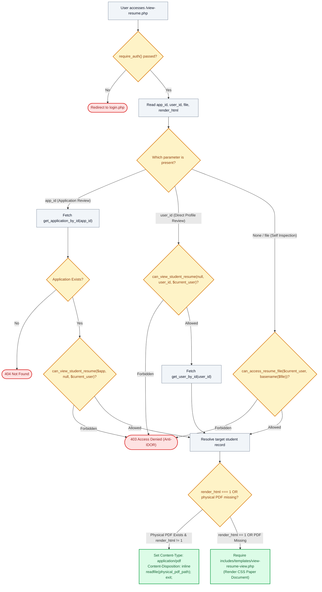

# 📄 `view-resume.php` — PDF Resume Streaming & IDOR-Guarded Document Server

> [!abstract] 📌 Executive Summary
> `view-resume.php` acts as the **secure credential transmission gateway** for candidate resumes. It enables employers, administrators, and student owners to view attached Curriculum Vitae while strictly blocking unauthorized third-party snooping. Key security and operational mechanisms include:
> 1. **Authentication Enforcement**: Rejects unauthenticated requests via `require_auth()`.
> 2. **Anti-IDOR Authorization Matrix (`can_view_student_resume`)**: Verifies whether an employer owns the specific job requisition or if an admin/owner is requesting the record.
> 3. **Path Traversal Shield (`basename()`)**: Cleanses all filename inputs to prevent directory breakout attacks (e.g. `../../etc/passwd`).
> 4. **Direct Binary Streaming**: Emits inline HTTP PDF headers and streams binary files via `readfile()`.
> 5. **Synthetic HTML Resume Fallback**: If no physical PDF file exists on disk (or `?render_html=1` is passed), seamlessly delegates to `view-resume-view.php` to render an accessible HTML paper resume.

---

## 🏛️ Placement in System Architecture



---

## 🔍 Line-by-Line Technical Analysis

### Lines 1–16: Route Authentication & Parameter Parsing
```php
<?php
/**
 * Campus Job Posting System - PDF Resume Viewer & Document Server
 * Allows employers, admins, and student owners to view attached PDF resumes.
 */
require_once __DIR__ . '/includes/data-helper.php';
require_once __DIR__ . '/includes/auth-check.php';

require_auth();
$current_user = get_logged_user();

$app_id = $_GET['app_id'] ?? ($_GET['id'] ?? null);
$user_id = $_GET['user_id'] ?? null;
$file_param = $_GET['file'] ?? null;
$force_html = isset($_GET['render_html']) && $_GET['render_html'] === '1';
```
- Restricts document streaming exclusively to authenticated sessions.
- Extracts routing modes: application-bound (`$app_id`), user-bound (`$user_id`), or filename-bound (`$file_param`).

---

### Lines 21–37: Branch 1 — Application-Linked Authorization
```php
if ($app_id) {
    $app = get_application_by_id($app_id);
    if ($app) {
        $resume_filename = $app['resume_file'] ?? 'Student_Resume.pdf';
    }

    if (!$app) {
        http_response_code(404);
        die('The specified student application could not be found.');
    }

    if (!can_view_student_resume($app, null, $current_user)) {
        http_response_code(403);
        die('Access Denied: You are not authorized to view this candidate credential.');
    }

    $target_student = get_user_by_id($app['student_id'] ?? 0) ?? get_user_by_email($app['student_email'] ?? '');
}
```
- **IDOR Protection (`can_view_student_resume`)**: Verifies that:
  - If the viewer is an **Admin**, access is granted.
  - If the viewer is a **Student**, access is granted *only* if `app.student_id === current_user.id`.
  - If the viewer is an **Employer**, access is granted *only* if the underlying job requisition was posted by this specific employer's organization.

---

### Lines 38–56: Branch 2 — User-Linked Profile Inspection
```php
} elseif ($user_id) {
    if (!can_view_student_resume(null, $user_id, $current_user)) {
        http_response_code(403);
        if (($current_user['role'] ?? '') === 'employer') {
            die('Access Denied: You are not authorized to view this candidate credential.');
        } else {
            die('Access Denied: You are not authorized to inspect other student records.');
        }
    }

    $target_student = get_user_by_id($user_id);
    if ($target_student) {
        $resume_filename = !empty($target_student['resume_file']) ? basename($target_student['resume_file']) : (($target_student['name'] ?? 'Student') . '_Resume.pdf');
    }
```
- Blocks horizontal privilege escalation between peer students (e.g. Student A attempting to inspect Student B's profile credentials).
- Automatically resolves the student's stored profile resume (`$target_student['resume_file']`) when present.

---

### Lines 57–72: Branch 3 — Self-Inspection & Path Traversal Neutralization
```php
} else {
    $target_student = $current_user;
    if ($file_param) {
        $requested_file = basename($file_param);

        if (!can_access_resume_file($current_user, $requested_file)) {
            http_response_code(403);
            die('Access Denied: You are not authorized to inspect this document.');
        }

        $resume_filename = $requested_file;
    } elseif (!empty($current_user['resume_file'])) {
        // Direct stream of student's saved profile resume
        $resume_filename = basename($current_user['resume_file']);
    }
}
```
- **Path Traversal Defense (`basename($file_param)`)**: Strips any directory traversal strings (e.g., `../../`, `..\..\Windows\win.ini`), forcing resolution to a flat file name inside the upload directory.
- **Direct Profile CV Inspection**: If no file parameter is passed, automatically streams the student's active profile resume (`$current_user['resume_file']`).
- Verifies document ownership via `can_access_resume_file()`.

---

### Lines 71–94: Candidate Profile Hydration
- Resolves student biographical fields (`$student_name`, `$student_number`, `$student_course`, `$student_year`, `$cover_letter`, `$availability`) from the application or user profile to ensure complete data availability for the HTML template fallback.

---

### Lines 96–119: Binary PDF Streaming vs. HTML Simulation Fallback
```php
$candidate_paths = [
    __DIR__ . '/uploads/resumes/' . basename($resume_filename)
];

$physical_pdf_path = null;
if (!$force_html) {
    foreach ($candidate_paths as $p) {
        if (file_exists($p) && is_file($p) && strtolower(pathinfo($p, PATHINFO_EXTENSION)) === 'pdf') {
            $physical_pdf_path = $p;
            break;
        }
    }
}

if ($physical_pdf_path && file_exists($physical_pdf_path)) {
    header('Content-Type: application/pdf');
    header('Content-Disposition: inline; filename="' . basename($resume_filename) . '"');
    header('Content-Transfer-Encoding: binary');
    header('Accept-Ranges: bytes');
    header('Content-Length: ' . filesize($physical_pdf_path));
    header('Cache-Control: private, max-age=0, must-revalidate');
    header('Pragma: public');
    readfile($physical_pdf_path);
    exit;
}

require __DIR__ . '/includes/templates/view-resume-view.php';
```
- **Binary Streaming Headers**: Sets `Content-Type: application/pdf` and `Content-Disposition: inline`, allowing the browser's native PDF reader (Chrome PDF Viewer, Acrobat plugin) to render the document directly in a tab rather than forcing a file download.
- **Fail-Safe Fallback**: If the resume was created using demo seed data (where no physical PDF was uploaded to the local disk) or the user requests HTML view (`?render_html=1`), the script seamlessly renders `view-resume-view.php`.

---

## 🛡️ Defense Talking Points & Security Disclosures

> [!tip] 🎓 Panelist Q&A Defense Sheet
> 
> **Q: What is an Insecure Direct Object Reference (IDOR), and how does `view-resume.php` prevent it?**
> **A:** An IDOR occurs when an application exposes a reference to an internal object (such as `view-resume.php?app_id=45`) without validating whether the requesting user is authorized to view that object. An attacker could alter the number to view other students' private resumes. This system prevents IDOR via `can_view_student_resume()`: employers can *only* view applications for jobs posted by their own office, and students can *only* view their own applications. Unauthorized attempts are terminated with an HTTP 403 Forbidden.
> 
> **Q: How does `basename()` protect against Path Traversal (Directory Traversal)?**
> **A:** If a malicious user supplies `view-resume.php?file=../../../../windows/win.ini`, passing that directly to `file_exists()` or `readfile()` would leak arbitrary server files. `basename()` strips directory delimiters (`/` and `\`) and returns only `win.ini`, constraining file lookups strictly to the protected `uploads/resumes/` folder.
