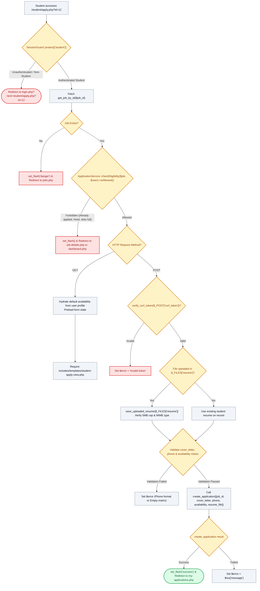

# ✍️ `student/apply.php` — Application Composer & Shift Availability Controller

> [!abstract] 📌 Executive Summary
> `student/apply.php` orchestrates the **student assistantship application submission pipeline**. It strictly guards entry to authenticated students via `SessionGuard::protect(['student'])`, executes real-time requisition eligibility gating (`ApplicationService::checkEligibility`), processes and validates uploaded PDF/DOC resumes (5MB cap), validates contact telephone formats, enforces mandatory weekly availability timeslot selection (the 18-slot matrix), and registers the submission through `create_application()`.

---

## 🏛️ Placement in System Architecture



---

## 🔍 Line-by-Line Technical Analysis

### Lines 1–25: Authentication & Requisition Existence Gate
```php
<?php
/**
 * Campus Job Posting System - Job Application Form
 * Archetype D: Application & Availability Matrix (COAL101 Blueprint)
 */
require_once __DIR__ . '/../includes/data-helper.php';
require_once __DIR__ . '/../includes/auth-check.php';

// Ensure student auth - employers and admins cannot apply.
// Guests go to the plain login form (never a demo auto-login), then return here.
$return_to = 'student/apply.php?id=' . urlencode((string)($_GET['id'] ?? ($_GET['job_id'] ?? '')));
$user = SessionGuard::protect(
    ['student'],
    $return_to,
    'Please sign in with your student account to submit an application.'
);
$job_id = $_GET['id'] ?? ($_GET['job_id'] ?? null);
$job = get_job_by_id($job_id);

if (!$job) {
    set_flash('danger', 'The requested opportunity could not be found or has been closed.');
    header('Location: jobs.php');
    exit;
}
```
- **`SessionGuard::protect(['student'], $return_to, ...)`**: Unlike standard `require_auth()`, `protect()` remembers the exact parameterized URL (`$return_to`), forwards unauthenticated visitors to `login.php?next=...`, and restricts submission privileges strictly to student accounts.
- Verifies that the requisition exists via `get_job_by_id($job_id)`.

---

### Lines 26–35: Multi-Constraint Requisition Eligibility Gating
```php
// Enforce Requisition Eligibility
$eligibility = ApplicationService::checkEligibility($job, $user);
if (!$eligibility->isAllowed()) {
    $flashType = ($eligibility->reason() === 'unverified_student') ? 'warning' : 'danger';
    set_flash($flashType, $eligibility->message());
    $dest = ($eligibility->reason() === 'unverified_student') ? 'dashboard.php' : ('job-details.php?id=' . $job['id']);
    header('Location: ' . $dest);
    exit;
}
```
- **Rigorous Eligibility Interception**: Prevents circumventing front-end restrictions. If a student is unverified, has already applied, or already holds an accepted job contract elsewhere, `isAllowed()` evaluates to `false` and immediately redirects away with explanatory flash feedback.

---

### Lines 36–61: CSRF Validation & Resume File Processing
```php
if ($_SERVER['REQUEST_METHOD'] === 'POST') {
    if (!verify_csrf_token($_POST['csrf_token'] ?? '')) {
        $error = 'Security validation failed (invalid CSRF session token). Please refresh and submit again.';
    } else {
        $cover_letter = trim($_POST['cover_letter'] ?? '');
        $phone = trim($_POST['phone'] ?? '');
        $availability = $_POST['availability'] ?? [];
        $digits_only = preg_replace('/[^0-9]/', '', $phone);

        $resume_name = ($user['name'] ?? 'Student') . '_Resume.pdf';

        if (isset($_FILES['resume']) && $_FILES['resume']['error'] !== UPLOAD_ERR_NO_FILE) {
            if ($_FILES['resume']['error'] !== UPLOAD_ERR_OK) {
                $error = 'File upload failed. Please verify that your resume file is under 5MB.';
            } else {
                $resume_path = save_uploaded_resume($_FILES['resume']);
                if (!$resume_path) {
                    $error = 'Invalid resume format or size. Accepted formats: PDF, DOC, DOCX (Max 5MB).';
                } else {
                    $resume_name = basename($resume_path);
                }
            }
        }
```
- **File Handling**: If a new file is uploaded, invokes `save_uploaded_resume($_FILES['resume'])` which enforces:
  - Size limitation: maximum 5MB.
  - Allowed extensions: `pdf`, `doc`, `docx`.
  - Path normalization: applies `basename()` to isolate the stored filename.
- If no file is uploaded, falls back to the default student resume identifier on file.

---

### Lines 62–87: Business Rule Validation & Application Registration
```php
        if (!$error) {
            if (empty($cover_letter)) {
                $error = 'Please provide a brief statement of intent / cover letter.';
            } elseif (empty($phone) || preg_match('/[a-zA-Z]/', $phone) || !preg_match('/^[\+]?[0-9\s\-()]{7,20}$/', $phone) || strlen($digits_only) < 7 || strlen($digits_only) > 15) {
                $error = 'Please provide a valid contact phone number consisting of numbers only (e.g., +63 917 123 4567 or 09171234567).';
            } elseif (empty($availability) || count($availability) === 0) {
                $error = 'Candidate Shift Availability is required and cannot be empty. Please select at least one available weekly timeslot in the matrix.';
            } else {
                $res = create_application([
                    'job_id' => $job['id'],
                    'cover_letter' => $cover_letter,
                    'phone' => $phone,
                    'availability' => $availability,
                    'resume_file' => $resume_name
                ]);

                if ($res['success']) {
                    set_flash('success', "Application successfully submitted for {$job['title']}! You can track its review progress below.");
                    header('Location: my-applications.php');
                    exit;
                }
                $error = $res['message'] ?? 'Failed to submit application. Please try again.';
            }
        }
```
- **Validation Constraints**:
  - `cover_letter`: Mandatory statement of intent.
  - `phone`: Length between 7 and 15 digits; alphabetical characters rejected.
  - `availability`: **Mandatory 18-slot matrix selection** (cannot be empty).
- **`create_application()`**: Inserts record into `applications` table or JSON datastore, triggers an automated notification to the hiring department, and redirects the student to `my-applications.php`.

---

### Lines 89–108: Preloading & View Handover
```php
$default_availability = (isset($_POST['availability']) && is_array($_POST['availability']))
    ? $_POST['availability']
    : ((!empty($user['availability']) && is_array($user['availability'])) ? $user['availability'] : [
        'Mon - Morning (8AM–12NN)',
        'Wed - Morning (8AM–12NN)',
        'Fri - Afternoon (1PM–5PM)'
    ]);

// Preload view data — no service/DB calls in the template
$form = $_POST;
$query = $_GET;
$files = $_FILES;
$view_flash = $_SESSION['flash'] ?? null;

require __DIR__ . '/../includes/templates/student-apply-view.php';
```
- Hydrates the availability matrix with the student's saved preferences from their profile settings, reducing repetitive form inputs.
- Invokes `student-apply-view.php`.

---

## 🛡️ Defense Talking Points & Security Disclosures

> [!tip] 🎓 Panelist Q&A Defense Sheet
> 
> **Q: How does the system prevent arbitrary file upload attacks (e.g. uploading a PHP web shell instead of a resume)?**
> **A:** As implemented in `save_uploaded_resume()` and `AttachmentStore`, uploaded files are validated through multiple security barriers:
> 1. Extension whitelisting: Only `pdf`, `doc`, and `docx` extensions are accepted; files ending in `.php`, `.phtml`, `.exe`, or `.js` are immediately rejected.
> 2. Magic byte / MIME inspection: File headers are checked via `finfo_file(FILEINFO_MIME_TYPE)` to confirm binary type.
> 3. Cryptographic file renaming: Stored files are prefixed with random hex bytes (`bin2hex(random_bytes(4))`) and stored in a protected directory shielded by an `.htaccess` rule that disables script execution (`php_flag engine off`).
> 
> **Q: Why is candidate availability mandatory during application submission?**
> **A:** Campus assistantships require schedule coordination between student lecture blocks and departmental staffing needs. Capturing the weekly matrix at submission enables department supervisors to immediately review shift alignment without back-and-forth email delays.
