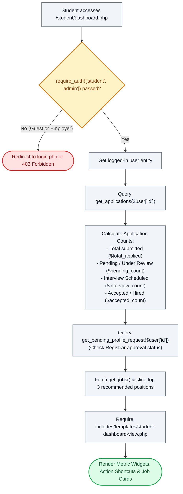

# 🎓 `student/dashboard.php` — Student Assistantship Hub & Metric Overview Controller

> [!abstract] 📌 Executive Summary
> `student/dashboard.php` is the **central portal landing controller** for student assistants. Gated by role-based access control (`require_auth(['student', 'admin'])`), it synthesizes personal application metrics (total submitted, pending review, interviews scheduled, and accepted contracts), checks for pending academic profile modification requests submitted to the Registrar, recommends open campus vacancies, and delegates rendering to `includes/templates/student-dashboard-view.php`.

---

## 🏛️ Placement in System Architecture



---

## 🔍 Line-by-Line Technical Analysis

### Lines 1–12: Role Gating & Identity Hydration
```php
<?php
/**
 * Campus Job Posting System - Student Dashboard
 * Archetype B: Student Dashboard & Application Hub (COAL101 Blueprint)
 */
require_once __DIR__ . '/../includes/data-helper.php';
require_once __DIR__ . '/../includes/auth-check.php';

require_auth(['student', 'admin']);
$user = get_logged_user();
$page_title = 'Student Dashboard & Application Portal';
```
- **Line 9 (`require_auth(['student', 'admin'])`)**: Strictly restricts route access. If an employer attempts to load this URL, they receive an HTTP 403 Forbidden. Unauthenticated guests are forwarded to `login.php?next=student/dashboard.php`.
- **Line 10**: Fetches the authenticated user profile array from session storage.

---

### Lines 13–19: Application Metric Computation
```php
// Applications for current student
$my_apps = get_applications($user['id'] ?? 0);
$total_applied = count($my_apps);
$pending_count = count(array_filter($my_apps, fn($a) => in_array($a['status'] ?? '', ['pending', 'Pending Review', 'under_review', 'Under Evaluation'])));
$interview_count = count(array_filter($my_apps, fn($a) => in_array($a['status'] ?? '', ['interview_scheduled', 'Interview Scheduled'])));
$accepted_count = count(array_filter($my_apps, fn($a) => in_array($a['status'] ?? '', ['accepted', 'Accepted / Hired'])));
```
- **Line 14**: Invokes `get_applications($user['id'])` from `includes/services/application-service.php` to fetch all historical and active submissions belonging to this student ID.
- **Lines 15–18**: Uses `array_filter` with closure status checks to partition submissions into 4 lifecycle metrics:
  - `$total_applied`: All-time submissions.
  - `$pending_count`: Dossiers currently in screening or department review.
  - `$interview_count`: Positions where an interview date has been set by a supervisor.
  - `$accepted_count`: Official assistantship appointments offered and confirmed.

---

### Lines 20–27: Pending Request Audit, Job Recommendations & Template Invocation
```php
$pending_profile_req = get_pending_profile_request($user['id'] ?? 0);

// Recommended Jobs (filtered by student course / general assistantships)
$all_jobs = get_jobs();
$recommended_jobs = array_slice($all_jobs, 0, 3);
// Last line: view template
require __DIR__ . '/../includes/templates/student-dashboard-view.php';
```
- **Line 20**: Calls `get_pending_profile_request()` to check whether the student has an in-progress academic record change request (such as a corrected GWA or revised COR). If pending, the view displays an informational alert banner.
- **Lines 23–24**: Pulls active requisitions via `get_jobs()` and slices the top 3 positions to feature in the "Recommended Opportunities" carousel.
- **Line 26**: Hands control over to `includes/templates/student-dashboard-view.php`.

---

## 🛡️ Defense Talking Points & Security Disclosures

> [!tip] 🎓 Panelist Q&A Defense Sheet
> 
> **Q: Can an employer or another student access this dashboard by tampering with the URL?**
> **A:** No. `require_auth(['student', 'admin'])` executes `SessionGuard::enforce()`. If the authenticated user's role is not `student` or `admin`, execution terminates immediately with a 403 Forbidden. Furthermore, `get_applications($user['id'])` sources the user ID strictly from `$_SESSION['user']['id']`, completely preventing horizontal IDOR access to another student's metrics.
> 
> **Q: What happens if a student has an active profile change request under review?**
> **A:** Line 20 populates `$pending_profile_req`. The template renders an active notice informing the student that their requested changes (such as an updated GWA or curriculum load) are pending review by the Registrar. While pending, further duplicate requests are blocked to preserve administrative workflow order.
