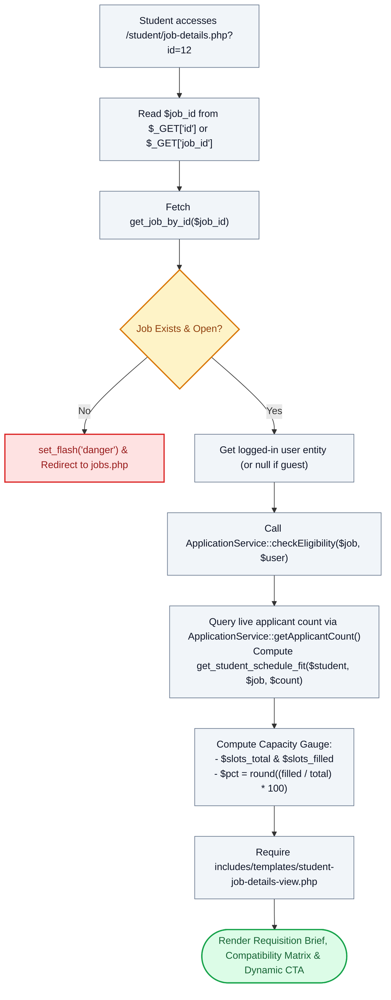

# 📋 `student/job-details.php` — Requisition Brief & Schedule Compatibility Controller

> [!abstract] 📌 Executive Summary
> `student/job-details.php` presents the **comprehensive job specification and candidate fit analyzer**. It pulls detailed position requisitions by ID, verifies vacancy existence, evaluates student eligibility in real-time via `ApplicationService::checkEligibility()`, executes an automated **Schedule Compatibility & Competition Analysis** (`get_student_schedule_fit`), calculates real-time slot capacity percentages, and delegates presentation to `includes/templates/student-job-details-view.php`.

---

## 🏛️ Placement in System Architecture



---

## 🔍 Line-by-Line Technical Analysis

### Lines 1–16: Requisition Fetch & 404 Interception
```php
<?php
/**
 * Campus Job Posting System - Job Opportunity Details
 * Archetype C: Detail & Action Sidebar (COAL101 Blueprint)
 */
require_once __DIR__ . '/../includes/data-helper.php';
require_once __DIR__ . '/../includes/auth-check.php';

$job_id = $_GET['id'] ?? ($_GET['job_id'] ?? null);
$job = get_job_by_id($job_id);

if (!$job) {
    set_flash('danger', 'The requested opportunity could not be found or has been closed.');
    header('Location: jobs.php');
    exit;
}
```
- Accepts either `id` or `job_id` from the URL query string.
- If the requested vacancy ID does not exist in the database or has been hard deleted, gracefully intercepts the request, enqueues an alert, and redirects to the jobs directory (`jobs.php`).

---

### Lines 18–22: Real-Time Eligibility Evaluation
```php
$user = get_logged_user();
$eligibility = ApplicationService::checkEligibility($job, $user);
$already_applied = ($eligibility->reason() === 'already_applied');
$app_status = $eligibility->applicationStatus() ?? 'pending';
```
- **`ApplicationService::checkEligibility($job, $user)`**: Returns a `RequisitionEligibility` Value Object that evaluates all multi-constraint business rules:
  - Is the user an authenticated student?
  - Has the user already applied to this specific job?
  - Is the student already hired in another active campus position (Single-Contract Rule)?
  - Is the job fully filled or expired?
- Identifies if the student already applied (`$already_applied = true`) and pulls their live application review status (`$app_status`).

---

### Lines 23–29: Schedule Compatibility & Applicant Contention Engine
```php
// Student schedule compatibility overview (read-only, never gates the Apply CTA).
// Guests see a neutral signed-out state; closed/expired/filled jobs hide the panel in the view.
// Applicant demand is counted live so competition reflects real contention, not fill state.
$fit_student = $user ?? ['id' => null, 'availability' => []];
$job_applicant_count = ApplicationService::getApplicantCount((int)($job['id'] ?? 0));
$student_schedule_fit = get_student_schedule_fit($fit_student, $job, $job_applicant_count);
```
- **Advisory Schedule Fit (`get_student_schedule_fit`)**: Compares the student's 18-slot weekly availability matrix against the job's shift requirements from `includes/services/system-checks.php`.
- **Live Competition Meter**: Queries `ApplicationService::getApplicantCount()` to show real-time applicant contention (e.g. *Low Competition: 2 applicants for 3 slots* vs *High Competition: 14 applicants for 2 slots*).

---

### Lines 30–41: Capacity Metrics & View Handover
```php
$is_partner = ($job['employer_type'] ?? '') === 'approved_partner';
$org_name = $job['organization_name'] ?? ($job['department'] ?? 'Campus Organization');
$jtype = $job['job_type'] ?? 'Student Assistant';
$wsetup = $job['work_setup'] ?? 'On-Campus';
$slots_total = (int)($job['slots_total'] ?? $job['vacancies'] ?? 1);
$slots_filled = (int)($job['slots_filled'] ?? 0);
$pct = ($slots_total > 0) ? round(($slots_filled / $slots_total) * 100) : 0;

$page_title = $job['title'] . ' | Opportunity Details';
// Last line: view template
require __DIR__ . '/../includes/templates/student-job-details-view.php';
```
- Computes fill rate percentage (`$pct`) for the visual capacity progress bar.
- Prepares title and loads `student-job-details-view.php`.

---

## 🛡️ Defense Talking Points & Security Disclosures

> [!tip] 🎓 Panelist Q&A Defense Sheet
> 
> **Q: What happens if a student tries to apply for a job that is already 100% filled?**
> **A:** On `student/job-details.php`, `ApplicationService::checkEligibility()` evaluates `slots_filled >= slots_total`. If full, `$eligibility->isAllowed()` returns `false` with the reason `'slots_full'`. The visual template automatically transforms the *Apply Now* button into a disabled *Positions Filled* state. Even if a user attempts to bypass the UI by manually navigating to `student/apply.php?id=12`, the same eligibility gate executes on the controller and blocks submission.
> 
> **Q: Does the schedule compatibility calculation prevent students with partial conflicts from applying?**
> **A:** No. As noted on line 23, the schedule fit analysis is strictly **read-only and advisory**. It provides transparency so students know if their free periods match the office's requested shifts, but it does not rigidly block submission because department supervisors and students frequently negotiate shift hours during interviews.
