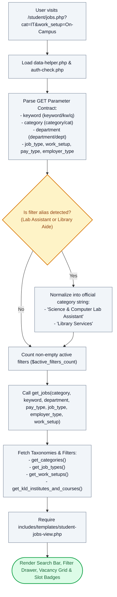

# 🔍 `student/jobs.php` — Faceted Vacancy Search & Assistantship Directory Controller

> [!abstract] 📌 Executive Summary
> `student/jobs.php` manages the **publicly accessible vacancy catalog and faceted search engine**. It enables students and prospective applicants to filter campus assistantships across 7 dimensions (keyword, category, department, job type, work setup, compensation model, and employer accreditation). It normalizes quick-filter aliases (e.g. mapping `Lab Assistant` to `Science & Computer Lab Assistant`), computes active filter counts, preloads institutional department taxonomies, and delegates rendering to `includes/templates/student-jobs-view.php`.

---

## 🏛️ Placement in System Architecture



---

## 🔍 Line-by-Line Technical Analysis

### Lines 1–19: GET Parameter Contract & Aliasing Support
```php
<?php
/**
 * Campus Job Posting System - Student Job Listings & Search
 * Archetype B/C: Search & Card Grid (COAL101 Blueprint)
 */
require_once __DIR__ . '/../includes/data-helper.php';
require_once __DIR__ . '/../includes/auth-check.php';

$page_title = 'Browse Campus Vacancies & Assistantships';

// GET Parameter Contract
$keyword = trim($_GET['keyword'] ?? $_GET['kw'] ?? $_GET['q'] ?? '');
$category = trim($_GET['category'] ?? $_GET['cat'] ?? '');
$department = trim($_GET['department'] ?? $_GET['dept'] ?? '');
$job_type = trim($_GET['job_type'] ?? '');
$work_setup = trim($_GET['work_setup'] ?? '');
$pay_type = trim($_GET['pay_type'] ?? '');
$employer_type = trim($_GET['employer_type'] ?? '');
```
- **Public Accessibility**: Note that `student/jobs.php` intentionally omits `require_auth()`. This allows unauthenticated prospective applicants and campus visitors to browse vacancies before registering. Authentication is enforced downstream when the student clicks *Apply Now*.
- **Parameter Fallbacks**: Accepts multiple query aliases (e.g. `kw`, `q`, `cat`, `dept`) to support seamless redirection from navigation bars, quick-search modals, and external links.

---

### Lines 20–35: Taxonomy Normalization & Alias Interception
```php
// Handle aliases for quick filters
$is_lab_assistant_active = (strcasecmp($category, 'Science & Computer Lab Assistant') === 0 || strcasecmp($job_type, 'Lab Assistant') === 0);
$is_library_aide_active = (strcasecmp($category, 'Library Services') === 0 || strcasecmp($job_type, 'Library Aide') === 0 || strcasecmp($job_type, 'Library') === 0);

if (strcasecmp($job_type, 'Lab Assistant') === 0) {
    if (empty($category)) {
        $category = 'Science & Computer Lab Assistant';
    }
    $job_type = '';
} elseif (strcasecmp($job_type, 'Library Aide') === 0 || strcasecmp($job_type, 'Library') === 0) {
    if (empty($category)) {
        $category = 'Library Services';
    }
    $job_type = '';
}
```
- **Semantic Mapping**: Normalizes loose colloquial search queries into canonical category identifiers so users clicking "Lab Assistant" chips are routed to the official `Science & Computer Lab Assistant` category filter without generating zero-result queries.

---

### Lines 36–52: Active Filter Counter & Multi-Parametric Search Execution
```php
$active_filters_count = 0;
if (!empty($keyword)) $active_filters_count++;
if (!empty($category)) $active_filters_count++;
if (!empty($department)) $active_filters_count++;
if (!empty($job_type)) $active_filters_count++;
if (!empty($work_setup)) $active_filters_count++;
if (!empty($employer_type)) $active_filters_count++;

$jobs = get_jobs(
    $category ?: null,
    $keyword ?: null,
    $department ?: null,
    $pay_type ?: null,
    $job_type ?: null,
    $employer_type ?: null,
    $work_setup ?: null
);
```
- **Active Filter Counter**: Tracks how many filter dimensions are currently applied to drive the "Reset All Filters ($count)" badge in the UI.
- **`get_jobs()` Execution**: Dispatches 7 distinct filter arguments to `includes/services/job-service.php`. The ternary `?: null` converts empty strings to `null`, ensuring SQL queries omit inactive WHERE conditions.

---

### Lines 54–63: Taxonomy Preloading & View Handover
```php
$categories = get_categories();
$all_job_types = get_job_types();
$all_work_setups = get_work_setups();

// Preload view data — no service/DB calls in the template
$view_get_kld_institutes_and_courses = get_kld_institutes_and_courses();

// Last line: view template
require __DIR__ . '/../includes/templates/student-jobs-view.php';
```
- Prepares filter dropdown values (`$categories`, `$all_job_types`, `$all_work_setups`) and institutional course trees before rendering `student-jobs-view.php`.

---

## 🛡️ Defense Talking Points & Security Disclosures

> [!tip] 🎓 Panelist Q&A Defense Sheet
> 
> **Q: Why is `student/jobs.php` accessible to guests without logging in?**
> **A:** Open recruitment visibility is an intentional design choice. Allowing students to view available positions, requirements, and stipends before registering encourages enrollment in the program. However, actual application submission (`student/apply.php`) is strictly protected by `SessionGuard::protect(['student'])`.
> 
> **Q: How does the search function defend against SQL Injection?**
> **A:** All search parameters (`$keyword`, `$category`, etc.) passed to `get_jobs()` are sanitized and bound using **PDO Prepared Statements** (`:keyword`, `:category`) with wildcards (`%keyword%`) in `job-service.php`. User input is never concatenated directly into SQL query strings.
