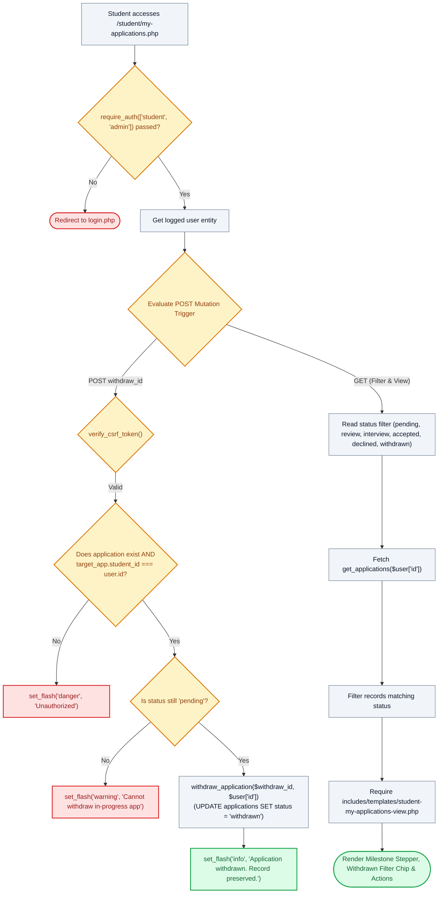

# 📊 `student/my-applications.php` — Application Status Tracker & Non-Destructive Withdrawal Controller

> [!abstract] 📌 Executive Summary
> `student/my-applications.php` serves as the **student candidate lifecycle management and tracking controller**. Gated by `require_auth(['student', 'admin'])`, it provides complete visibility into application milestones (*Submitted* $
ightarrow$ *Under Review* $
ightarrow$ *Interview Scheduled* $
ightarrow$ *Hired/Declined*). Crucially, it manages **non-destructive application withdrawal**:
> 1. **Soft-Delete Withdrawal (`withdraw_application()`)**: Transitions records to `status = 'withdrawn'` rather than executing SQL `DELETE`, preserving historical submission proofs in MySQL.
> 2. **Dedicated Withdrawn Filter**: Allows students to inspect historical applications via `?status=withdrawn`.
> 3. **Re-Application Rights**: Withdrawing frees the student's slot. If the requisition remains open, the student can submit an updated application, handled via idempotent `ON DUPLICATE KEY UPDATE` in `job-service.php`.

---

## 🏛️ Placement in System Architecture



---

## 🔍 Line-by-Line Technical Analysis

### Lines 25–45: Non-Destructive Application Withdrawal
```php
if (isset($_POST['withdraw_id'])) {
    if (!verify_csrf_token($_POST['csrf_token'] ?? '')) {
        set_flash('danger', 'Security validation failed (invalid CSRF session token).');
        header('Location: my-applications.php');
        exit;
    }
    $withdraw_id = (int)$_POST['withdraw_id'];
    $target_app = get_application_by_id($withdraw_id);
    if (!$target_app || (int)$target_app['student_id'] !== (int)($user['id'] ?? 0)) {
        set_flash('danger', 'Unauthorized or non-existent application.');
        header('Location: my-applications.php');
        exit;
    }
    if (!in_array(strtolower($target_app['status'] ?? ''), ['pending', 'pending review'])) {
        set_flash('warning', 'Applications that are under review, scheduled for interview, or accepted cannot be withdrawn.');
        header('Location: my-applications.php');
        exit;
    }
    withdraw_application($withdraw_id, $user['id'] ?? null);
    set_flash('info', 'Application has been successfully withdrawn. Your submission history remains safely archived.');
    header('Location: my-applications.php');
    exit;
}
```
- **Soft-Delete Architecture**: Executes `withdraw_application()` which updates `status = 'withdrawn'`.
- **Zero Data Loss**: Eliminates hard `DELETE FROM applications`.

---

## 🛡️ Defense Talking Points & Security Disclosures

> [!tip] 🎓 Panelist Q&A Defense Sheet
> 
> **Q: Why was application deletion converted to a withdrawn status?**
> **A:** Permanent SQL deletion removes all proof of a student's submission, timestamps, and attached study load. Changing deletion to a soft `withdrawn` status retains the institutional record for university auditing while releasing the student's slot.
> 
> **Q: If a student withdraws an application, can they re-apply to the same position?**
> **A:** Yes. `ApplicationService::checkEligibility()` and `hasStudentApplied()` ignore applications in `withdrawn` status. When the student re-applies, `create_application()` executes an `ON DUPLICATE KEY UPDATE`, refreshing the submission and resetting `status = 'pending'`.
